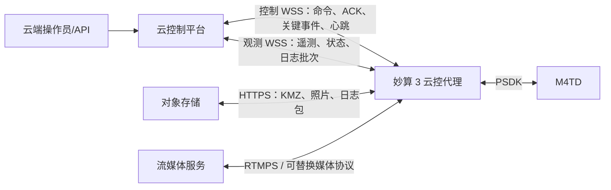
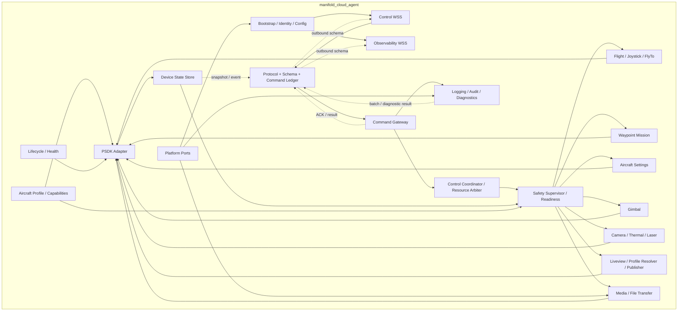

# 妙算 3 + M4TD 云控代理架构与实施计划

> 文档状态：架构方案 v0.3，待协议评审和 M4TD 真机能力验证
>
> 首版目标机型：DJI Matrice 4TD（M4TD）
>
> SDK 基线：本仓库 Payload SDK 3.16.0（build 2338）
>
> 修订日期：2026-07-22
>
> 本文只规定架构、协议和实施计划，不包含业务代码。

## 1. 目标、范围与结论

目标链路为：

```text
云服务器
   ⇅ HTTPS / WSS / RTMPS（经 5G IP 网络）
妙算 3 manifold_cloud_agent
   ⇅ PSDK
M4TD 飞行器、云台、相机
```

`manifold_cloud_agent` 是运行在妙算 3 上的安全云控代理。它负责把云端请求转换为有鉴权、有前置检查、有状态、有最终结果的 PSDK 操作，并持续上报飞行器状态、应用健康和审计信息。它不是简单的“WebSocket 消息 → PSDK 函数”转发器。

本项目负责：

- PSDK、网络会话和各业务模块的生命周期；
- 云端设备鉴权、协议校验、命令幂等和状态同步；
- 飞行、航线、云台、相机、直播和文件任务的状态机；
- 云端逻辑租约、DJI 摇杆控制权和任务互斥；
- 本地安全联锁、弱网/断网策略、控制权丢失处理；
- 遥测、状态、日志、审计、媒体和诊断数据上报；
- M4TD 能力适配，并为后续机型保留扩展边界；
- 可替换的 PSDK/网络/时钟/文件接口和独立测试入口。

云服务器必须负责：

- 用户认证、RBAC、操作审批和单设备单控制者仲裁；
- 设备注册、设备证书、短期会话票据和吊销；
- 命令服务、实时状态服务、审计存储和告警；
- KMZ、照片、日志包的对象存储及短期签名 URL；
- 直播鉴权、流媒体接入和播放分发；
- 如需“机场任务状态”，对接 DJI Dock/Cloud API 并作为该状态的权威来源。

本期不负责 USB-C 5G 模组的驱动、拨号、SIM 管理和网络切换，但应用网络层不得绑定某种网卡；接入 5G 后应无需修改业务协议。

### 1.1 已确认的产品决策（2026-07-22）

- `REQ-SET-005 设置返航电量`：批准从首版实现/发布门中延期；需求优先级仍为 MUST，但首版 `release_scope=APPROVED_DEFERRED`、设备 availability=`UNSUPPORTED_BY_PSDK`。不注册真实 setter，不用应用侧阈值冒充飞控原生设置。
- `REQ-SET-004 视频码流`：本文定义为“妙算发送到云端的实时视频输出 profile”，不是 SD 卡录像参数。profile 包含 `width_px`、`height_px`、`fps`（允许值 25 或 30）和 `target_bitrate_kbps`（不得大于 10000）。这里把“码率”解释为编码目标值；实际观测值必须另行上报，不能伪装成硬上限。
- FlyTo、紧急制动退出、RID 来源/单位等 M4TD 真机验证要求已知悉；这表示接受实施前提，不表示免除 HIL 和生产 capability 门禁。

分辨率尚未指定固定数值，因此由 M4TD Profile 上报经验证的 `(source, width_px, height_px, fps)` allowlist，云端只能从中选择，不允许设备静默取整、拉伸或改成其他帧率。

服务端需求台账需为延期记录 `decision_at/approved_by/affected_release/revisit_condition`；本文记录技术结论，不替代组织内审批留痕。

## 2. 对原计划的关键修正

| 原计划问题 | 修正结论 |
|---|---|
| 将 Waypoint V3 列为本阶段不实施 | 与必选需求冲突。PSDK 3.16 已有 KMZ 上传及 START/STOP/PAUSE/RESUME，纳入首版正式范围。 |
| 用 `CLOUD_API` 与 `MANIFOLD_PSDK` 表示 DJI 控制权 | 概念不准确。必须拆成“云端控制租约”“DJI 摇杆 authority”“当前飞行动作/任务 owner”三层。两套 PSDK 数据源的 owner 枚举不同，需归一化 RC/MSDK/INTERNAL/PSDK/DOCK/UNKNOWN。 |
| 默认假设所有飞控命令都依赖同一种控制权 | `ObtainJoystickCtrlAuthority` 明确是摇杆控制权；离散动作、FlyTo 和 Waypoint 的具体前置条件必须逐项按 M4TD 真机验证，不能在架构中混为一谈。 |
| 将 PSDK 的 RC 失联动作作为 M4TD 云链路保护 | 当前头文件明确 `SetRCLostAction` 仅支持 M30，不能作为 M4TD 云端断链方案。云 WSS 失联保护由妙算应用本地状态机执行；应用/PSDK 自身失联则以飞行器固件行为为最终兜底。 |
| 未覆盖完整相机、设置和航线需求 | 增加 AircraftSettings、Thermal/Laser、MediaTransfer、WaypointMission 等正式模块和状态机。 |
| 承诺“设置返航电量” | PSDK 3.16 公开 API 只有返航所需电量/剩余时间回调，没有设置返航电量的 API。产品已批准首版延期；需求登记为 APPROVED_DEFERRED，设备 capability 如实为 UNSUPPORTED_BY_PSDK，不能伪实现。 |
| 混淆实时码流与 SD 卡录像参数 | REQ-SET-004 已冻结为云端实时视频输出 profile。PSDK 可设置 Liveview 目标码率，但没有设置 Liveview 分辨率/帧率的 API；优先匹配原生 H.264 profile，不匹配时只能走经性能认证的变换管线或拒绝。 |
| 把机场任务状态视为 PSDK 状态 | 当前公开 PSDK 未提供 Dock 任务状态 API。设备可上报自己的 Waypoint 状态；机场任务状态应由云服务对接 Dock/Cloud API。 |
| 直播只考虑 RTMP 白名单 | 公网 5G 上生产环境应使用 RTMPS，或另选带加密的 SRT/WebRTC/VPN；明文 RTMP 只允许隔离测试网。 |
| 离散命令和摇杆流共用 `seq` 重放逻辑 | 离散命令以持久化 `command_id` 幂等；只有连续 setpoint 流使用 `stream_id + seq`。两者语义分离。 |
| 把 PSDK 函数返回成功当作业务完成 | PSDK 返回通常只代表请求被接受。动作完成必须结合状态订阅、回调、读回值和超时判断。 |

另有一个 SDK 文档内部不一致：`E_DjiFlightControllerGoHomeAltitude` 的注释为 20～500 m，而 `SetGoHomeAltitude` 的函数注释为 20～1500 m。首版不得硬编码较宽范围，必须由 M4TD Profile、官方确认和真机验证给出有效区间，并在设置后读回确认。

## 3. 需求与 PSDK 能力矩阵

状态说明：

- `应用能力`：主要由本应用/云端实现；
- `API 存在，待 M4TD 验证`：本地 PSDK 3.16 有公开接口，但仍需按机型、相机和固件真机认证；
- `部分支持`：只能提供明确的子集，协议必须暴露来源和限制；
- `外部阻塞`：当前公开 PSDK 无对应能力，不得对外宣称已实现。

优先级、发布范围和设备可用性是三个独立维度：`MUST/PLANNED` 保留原需求优先级；`REQUIRED/APPROVED_DEFERRED` 描述当前 release scope；`SUPPORTED_VERIFIED/.../UNSUPPORTED_BY_PSDK` 描述 runtime availability。除表中明确注明外，MUST 的首版 release scope 均为 REQUIRED。只有带日期/版本/批准人的 `APPROVED_DEFERRED` 决策可暂时解除某个 MUST 的当期发布门，不能把延期伪装成设备支持。

| ID | 优先级 | 需求 | 设备侧实现依据 | 结论 |
|---|---|---|---|---|
| REQ-LOG-001 | PLANNED | 日志管理、远程日志 | 异步日志、滚动文件、远程批量上报、诊断包 | 应用能力 |
| REQ-DATA-001 | MUST | 遥测数据 | 以 `DjiFcSubscription_*`、HMS、相机轮询/读回和云台 topic 为主；FlightController OSD callback 默认受限 | API 存在，待 M4TD 验证 |
| REQ-DATA-002 | MUST | 状态数据 | 飞行状态、display mode、控制权、HMS、业务状态机 | API 存在 + 应用聚合 |
| REQ-DATA-003 | PLANNED | 信道质量 | WSS RTT/抖动/重连/吞吐、Linux 网卡统计；5G RSRP/RSRQ/SINR 等需未来模组适配 | 部分支持 |
| REQ-DATA-004 | PLANNED | 负载信息 | 拆成妙算资源负载与挂载负载清单，避免业务歧义 | 应用聚合 + PSDK 只读能力 |
| REQ-LIVE-001 | MUST | 开始直播 | `DjiLiveview_StartH264Stream` + publisher 状态机 | API 存在，待 M4TD 验证 |
| REQ-LIVE-002 | MUST | 结束直播 | `DjiLiveview_StopH264Stream` + publisher 停止确认 | API 存在，待 M4TD 验证 |
| REQ-SET-001 | MUST | 避障设置 | 水平/上/下视觉避障 set/get；不调用仅适配 FC100 的 `SetAllAvoidAction` | API 存在，待 M4TD 验证 |
| REQ-SET-002 | MUST | 返航点设置 | 当前 GPS 或指定 GPS 返航点 | API 存在，待 M4TD 验证 |
| REQ-SET-003 | MUST | 返航高度设置 | `Set/GetGoHomeAltitude`，按 Profile 限值并读回 | API 存在，范围待确认 |
| REQ-SET-004 | MUST | 云端实时视频 profile：宽、高、25/30 fps、≤10000 kbps | `StartH264Stream` + `SetEncodingStrategy`；宽高/fps 从 H.264 实际流验证，PSDK 无对应 Liveview setter | 部分 API + 应用 profile/可选变换，待 M4TD 验证 |
| REQ-SET-005 | MUST | 设置返航电量 | 无公开 setter；只有 `RegisterBatteryCapacityGohomeCallBack` 读取 | release scope=`APPROVED_DEFERRED`；availability=`UNSUPPORTED_BY_PSDK` |
| REQ-GIM-001 | MUST | 云台转动 | `DjiGimbalManager_Rotate`，相对/绝对/速度模式 | API 存在，待 M4TD 验证 |
| REQ-GIM-002 | PLANNED | 云台跟随模式 | `DjiGimbalManager_SetMode`，FREE/FPV/YAW_FOLLOW | API 存在，待 M4TD 验证 |
| REQ-GIM-003 | PLANNED | 云台姿态设置 | absolute rotate + observed attitude | API 存在，待 M4TD 验证 |
| REQ-NOTIFY-001 | PLANNED | 航线结束通知 | Waypoint V3 mission/action callback + 本地 run 状态 | API 存在，但终态语义待验证 |
| REQ-NOTIFY-002 | PLANNED | 图片上传完成通知 | 相机下载状态机 + HTTPS 上传成功 + 服务端落库确认 | 应用/服务端能力 |
| REQ-NOTIFY-003 | PLANNED | 无人机准备完成通知 | ReadinessEvaluator 综合产生，携带未就绪原因 | 应用能力 |
| REQ-NOTIFY-004 | PLANNED | 机场任务状态通知 | 当前公开 PSDK 无 Dock 任务状态 | **云端 Dock/Cloud API 责任** |
| REQ-CAM-001 | MUST | 拍照 | CameraManager 设置拍照模式并启动拍照 | API 存在，待 M4TD 验证 |
| REQ-CAM-002 | MUST | 开始/停止录像 | `StartRecordVideo` / `StopRecordVideo` + 状态查询 | API 存在，待 M4TD 验证 |
| REQ-CAM-003 | MUST | 变焦 | 连续/指定光学变焦，红外变焦按能力开放 | API 存在，待 M4TD 验证 |
| REQ-CAM-004 | MUST | 对焦 | 设置 focus mode/target/ring | API 存在，待 M4TD 验证 |
| REQ-CAM-005 | MUST | 激光测距 | `GetLaserRangingInfo`，最高 5 Hz；公开 API 只能读取，不能主动开启激光 | 部分 API 存在，待 M4TD 验证 |
| REQ-CAM-006 | MUST | 单点测温 | 设置点坐标后读取点温 | API 存在，待 M4TD 验证 |
| REQ-CAM-007 | MUST | 区域测温 | 设置区域后读取均值/最小/最大温度和坐标 | API 存在，待 M4TD 验证 |
| REQ-CAM-008 | MUST | 切换可见光/红外镜头 | CameraManager stream source 和 Liveview source | API 存在，待 M4TD 验证 |
| REQ-CAM-009 | MUST | 设置拍照/录像模式 | `DjiCameraManager_SetMode` | API 存在，待 M4TD 验证 |
| REQ-CAM-010 | MUST | 格式化 SD 卡 | `DjiCameraManager_FormatStorage` | API 存在；高危操作 |
| REQ-CAM-011 | PLANNED | 照片回传 | 文件列表、下载权、单文件下载回调 + HTTPS 对象存储 | API 存在 + 应用能力 |
| REQ-FLT-001 | MUST | 起飞 | `StartTakeoff` + 飞行状态闭环 | API 存在，待 M4TD 验证 |
| REQ-FLT-002 | MUST | 返航 | `StartGoHome` + 状态闭环 | API 存在，待 M4TD 验证 |
| REQ-FLT-003 | MUST | 取消返航 | `CancelGoHome` + 状态闭环 | API 存在，待 M4TD 验证 |
| REQ-FLT-004 | MUST | 降落 | `StartLanding` + 确认阶段/状态闭环 | API 存在，待 M4TD 验证 |
| REQ-FLT-005 | MUST | 取消降落 | `CancelLanding` + 状态闭环 | API 存在，待 M4TD 验证 |
| REQ-FLT-006 | MUST | 强制降落 | `StartForceLanding` | API 存在；高危操作 |
| REQ-FLT-007 | MUST | 方向控制 | 本地定频 `ExecuteJoystickAction` | API 存在，待弱网和 M4TD 验证 |
| REQ-FLT-008 | MUST | 指点飞行 | `SetModeStartMission` 及任务/轨迹回调；头文件与 sample 的经纬度单位存在矛盾 | API 存在，属于 HIL 阻断项 |
| REQ-FLT-009 | MUST | 紧急制动 | `ExecuteEmergencyBrakeAction` | API 存在，执行/退出待 M4TD 验证 |
| REQ-FLT-010 | MUST | 切换/重获无人机控制权 | obtain/release joystick authority + authority event callback | API 存在，待 M4TD 验证 |
| REQ-MSN-001 | MUST | 上传 KMZ | HTTPS 下载、校验后 `DjiWaypointV3_UploadKmzFile` | API 存在，待 M4TD 验证 |
| REQ-MSN-002 | MUST | 开始航线 | `DjiWaypointV3_Action(START)` | API 存在，待 M4TD 验证 |
| REQ-MSN-003 | MUST | 暂停航线 | `DjiWaypointV3_Action(PAUSE)` | API 存在，待 M4TD 验证 |
| REQ-MSN-004 | MUST | 继续航线 | `DjiWaypointV3_Action(RESUME)` | API 存在，待 M4TD 验证 |
| REQ-MSN-005 | MUST | 停止航线 | `DjiWaypointV3_Action(STOP)` | API 存在，待 M4TD 验证 |

能力矩阵是协议的一部分。设备上线必须上报 `capabilities`，云端 UI/服务不得仅根据机型名称猜测功能。

## 4. 系统上下文与数据平面

第一版推荐四类独立数据平面：



### 4.1 为什么推荐两个 WSS

- 控制通道只承载小而有时效的消息，发送队列必须很短且不可被日志/遥测占满；
- 观测通道允许降采样、批量、压缩和丢弃低优先级数据；
- 遥测序列化或服务端消费变慢不能造成控制指令 head-of-line blocking；
- 观测通道中断时，控制通道仍可运行并上报最小安全状态。

如果首个原型只能建立一个 WSS，也必须在应用内部保留 `SAFETY > COMMAND_RESULT > EVENT > TELEMETRY > LOG` 的有界优先队列，并以配置开关保留拆分能力。单 WSS 默认只用于开发或非运动控制场景；生产开放 Joystick/FlyTo 前必须使用独立控制 WSS，除非专项安全评审和弱网数据证明单通道达到同等隔离。即便物理拆成多个连接，它们仍共享同一 5G 上行，BandwidthGovernor 必须对 WSS、RTMPS 和 HTTPS 实施全局带宽硬上限。

bootstrap 建立一个 `device_session_id`，控制和观测 WSS 分别使用各自的一次性 ticket 和 `channel_id` 附着到该设备会话。控制命令还必须绑定当前 `control_session_id`。观测连接在线不能证明控制连接在线；观测通道单独重连也不能击穿仍健康的控制会话。只有控制 WSS 的应用心跳和有效控制租约能维持云控会话。

### 4.2 文件和视频不走 WSS

- KMZ 使用短期签名 HTTPS GET；
- 照片、日志包使用短期签名 HTTPS PUT/分片上传；
- 实际 profile 匹配时将 H.264 直接 remux 后推往 RTMPS；只有 profile 不匹配且 LOCAL_TRANSFORM 已通过妙算性能/HIL 认证时才允许本地变换。两种路径都禁止经 JSON/WS 转发；
- WSS 只承载文件任务和直播会话的控制、进度及结果。

文件业务身份使用稳定的 `asset_id + size + SHA-256`，签名 URL 只是可刷新凭据。URL 过期时通过独立的 credential-refresh 消息更新，不能修改原始业务命令 body 并破坏 command ID 幂等。HTTP 默认关闭自动跳转；如确需跳转，每一跳都重新执行 scheme/域名/解析地址 allowlist，拒绝 loopback、link-local、私网和云元数据地址，防止 SSRF/DNS rebinding。

### 4.3 妙算直连云端

本项目通过妙算 3 Linux 网络栈主动连接云端，不使用 `DjiCloudApi_SendDataByWebSocket` 作为 5G 云链路。后者是经 Pilot 2 Cloud API 通道发送数据，语义和本项目的直连 WSS 不同。

## 5. 设备端总体架构



图中省略了部分内部事件总线细节，但不省略协议边界：业务模块不得直接拼接 WSS JSON；所有 ACK、结果、状态、事件、遥测和日志都必须经过 MessageCodec、对应 Schema、优先级队列及 ConnectionManager。关键命令结果/安全事件走控制通道，普通状态、遥测和日志走观测通道。

### 5.1 依赖规则

1. 业务模块不得直接包含或调用 PSDK C API，只能依赖内部接口；
2. 网络层不得解释飞行业务，PSDK 层不得解释云协议；
3. 所有可能改变飞机、任务、云台、相机、存储或直播状态的命令都经过 Command Gateway、Control Coordinator 和 Safety Supervisor；
4. PSDK 回调只复制必要数据、记录单调时钟并投递有界队列，不做网络、文件、JSON 或阻塞等待；
5. 日志上报不得反向依赖业务线程，日志/遥测拥塞不得阻塞控制；
6. 关键状态只有一个 owner，其他模块读取快照或订阅强类型事件；
7. 测试替身必须实现与生产适配器相同的业务接口，不在业务代码中散布 `if test`。

### 5.2 PSDK 适配器

```text
psdk/
├── PsdkRuntimeAdapter
├── AircraftInfoAdapter
├── FcSubscriptionAdapter
├── FlightControllerAdapter
├── RidInfoProvider
├── FlightActionAdapter
├── JoystickAuthorityAdapter
├── WaypointV3Adapter
├── GimbalManagerAdapter
├── CameraManagerAdapter
├── LiveviewAdapter
├── HmsManagerAdapter
└── PsdkErrorMapper
```

适配器负责 SDK 类型转换、回调桥接、错误映射和版本差异；不负责租约、命令幂等、云端 ACK 或业务重试。

### 5.3 唯一状态拥有者

| 状态 | Owner |
|---|---|
| 控制/观测 WSS 连接 | 各自 ConnectionManager |
| 云端控制租约、lease fence epoch | CloudControlLeaseManager |
| DJI 摇杆 authority、authority generation | JoystickAuthorityMonitor |
| 当前飞行动作/任务 | ControlCoordinator |
| 最新飞行器/相机/云台数据 | DeviceStateStore |
| 摇杆最新 setpoint | JoystickSetpointBuffer |
| 航线 run | WaypointMissionService |
| 直播会话 | LiveService |
| 媒体传输任务 | MediaTransferService |
| 有效配置 | ConfigService |
| 能力矩阵 | AircraftCapabilityRegistry |

## 6. 云端引导、鉴权与安全会话

### 6.1 启动引导

1. 读取只读默认配置、设备配置和设备凭据；
2. 按 17.1 节初始化日志、平台、PSDK Core 和各必需模块；先识别飞机，待 `DjiCore_ApplicationStart` 后再查询相机类型/固件/镜头；
3. 按实际飞机、负载和固件建立最终能力快照；未经验证的能力保持关闭；
4. 通过 HTTPS 向 bootstrap 服务进行设备认证；
5. 获取 `device_session_id`、控制/观测 WSS 地址、每通道独立的一次性 ticket、允许的媒体/对象存储域名和远程配置；
6. 校验配置签名、版本、有效期及安全范围后原子切换；
7. 分别建立 WSS，完成协议协商和 `session.sync`；
8. 上报 capabilities、readiness 和完整状态基线；
9. 只有控制会话、策略和能力均有效时才开放相应命令。

生产环境要求：

- HTTPS/WSS/RTMPS，严格校验证书；优先设备双向 TLS；
- 每台设备独立证书或密钥，支持轮换和吊销；
- 每个 channel ticket 短期、一次性，绑定设备、`device_session_id`、channel type、目标服务和 bootstrap 请求；
- 测试 HTTP/WS/RTMP 只在隔离网络和测试构建允许；
- 生产构建不能通过远程配置关闭 TLS 校验或开启测试控制入口；
- 设备时钟使用 NTP/系统时间，协议会话同时维护服务端时间偏差和单调时钟。

### 6.2 会话恢复

WSS 重连不等于业务恢复，且两条通道的恢复语义不同：

- 设备和服务端对同一 `device_session_id` 只允许一个 active control channel/`control_session_id`。新控制握手只有在双方原子 fence 并关闭旧连接后才可成功；任何时刻不得让两个连接都能续租或下发控制；

- **观测 WSS 单独重连**：使用新的 observability ticket/channel ID 附着到原 `device_session_id`，发送完整状态基线后继续；不得作废健康控制通道的 lease、fence 或 joystick stream。
- **控制 WSS 失联并重建**：先执行本地 link-loss policy；重新 bootstrap/握手得到新的 `control_session_id`，作废旧 lease fence 和旧 joystick stream，完成 `control.session.sync` 后才允许新控制。
- **设备进程重启**：生成新的 `boot_id` 和 device session；旧 control session、lease fence、authority generation、stream 全部失效。

控制会话恢复时还必须上报当前 authority、活动动作、航线、相机、直播、媒体任务及最近命令结果；重启期间状态不明的动作使用终态 `UNKNOWN` 并携带 `reason=AFTER_RESTART`。不得重放旧的起飞、拍照、强制降落等非幂等动作。文件 job 可按 ID 续传，但必须重新确认 URL 和校验值。

## 7. 云端通信协议

协议第一版使用受 JSON Schema 约束的 JSON。控制和状态频率在当前规模下不需要先引入 protobuf；MessageCodec 接口保持可替换，若压测证明 JSON 成为瓶颈，再协商二进制编码。

### 7.1 通用 envelope

```json
{
  "spec_version": "1.0",
  "kind": "command",
  "name": "flight.takeoff",
  "message_id": "01J...",
  "command_id": "01J...",
  "device_id": "m3-001",
  "target_boot_id": "boot-001",
  "control_session_id": "ctrl-sess-001",
  "trace_id": "trace-001",
  "sent_at": "2026-07-22T10:00:00.000Z",
  "expires_at": "2026-07-22T10:00:02.000Z",
  "control": {
    "lease_id": "lease-001",
    "fence_epoch": "42"
  },
  "body": {}
}
```

规则：

- `message_id` 标识一次传输；`command_id` 标识一次业务意图，重试时 command ID 不变；
- `target_boot_id` 绑定本次进程启动代际，设备重启后旧命令即使尚未过期也必须拒绝；
- `control_session_id` 绑定控制通道代际；观测通道有独立 channel ID，不使用它维持控制租约；
- `trace_id` 贯穿云端、设备、PSDK 错误和媒体任务；
- `expires_at` 在设备校正过的墙钟上校验，设备内部超时一律使用单调时钟；
- 所有改变飞机、任务、云台、相机、存储或直播状态的 `REMOTE_OPERATOR` 命令都要求有效 lease/fence 和对应 scope；纯查询免 lease 但仍要求认证/RBAC。日志级别等管理命令使用独立 management authorization、有效期和输出上限；
- Schema 限制消息大小、字符串长度、数值范围、枚举和未知字段策略；
- 大版本不兼容直接拒绝，小版本只允许向后兼容的可选字段；
- 超过 JavaScript 安全整数范围的 fence、generation、seq 和 revision 使用十进制字符串，或由 Schema 将数值严格限制在 `2^53-1` 内；
- 云端和设备都不能把 WebSocket 的到达顺序当作业务状态顺序。

### 7.2 连续摇杆消息

摇杆不用离散命令的持久化幂等模型：

```json
{
  "spec_version": "1.0",
  "kind": "stream",
  "name": "flight.joystick.setpoint",
  "message_id": "01J...",
  "device_id": "m3-001",
  "target_boot_id": "boot-001",
  "control_session_id": "ctrl-sess-001",
  "sent_at": "2026-07-22T10:00:00.100Z",
  "expires_at": "2026-07-22T10:00:00.300Z",
  "control": {
    "lease_id": "lease-001",
    "fence_epoch": "42",
    "authority_generation": "7",
    "stream_id": "stick-001",
    "seq": "1024"
  },
  "body": {
    "horizontal_frame": "BODY_FRU",
    "vx_mps": 1.0,
    "vy_mps": 0.0,
    "vertical_axis": "UP_POSITIVE",
    "vertical_velocity_mps": 0.0,
    "yaw_reference": "GROUND",
    "yaw_rate_dps": 0.0
  }
}
```

- 只接受同一 `stream_id` 中递增的 `seq`；
- 最新值覆盖旧值，不排队补发；
- 过期、旧 fence、旧 authority generation、旧 lease、旧 stream 的消息静默丢弃并按限频上报原因；
- 云端发送建议 10～20 Hz，本地 PSDK 输出循环初定 50 Hz；最终频率由 M4TD HIL 确认；
- 默认模式固定为 horizontal velocity + vertical velocity + yaw rate + stable enabled。M4TD 首版 Profile 只接受 `horizontal_frame=BODY_FRU`：x 向前、y 向右；z 永远向上为正，yaw angle/rate 永远以 ground 为参考。yaw 正方向必须在 M0 用 golden-vector HIL 冻结进 Schema，验证前不开启摇杆。协议可为未来 Profile 保留 `GROUND_NEU` 枚举，但首版收到它要确定性拒绝。不得用一个 BODY_FRU 标签错误覆盖 z/yaw，也不向公网暴露 thrust/attitude 等高风险原始模式。

### 7.3 命令结果生命周期

```text
RECEIVED
  ├─ REJECTED（协议、能力、租约、状态或安全检查失败）
  └─ ACCEPTED
       └─ EXECUTING
            ├─ SUCCEEDED
            ├─ FAILED
            ├─ CANCELLED
            ├─ TIMED_OUT
            ├─ AUTHORITY_LOST
            └─ UNKNOWN
```

- `RECEIVED` 仅表示解码和去重完成；
- `ACCEPTED` 仅表示业务接收，不表示 PSDK 动作完成；
- 每个已接受命令必须产生恰好一个终态；
- 长动作可发送限频 `command.progress`；
- 同一 `command_id` 重试返回已保存状态/终态，绝不再次调用非幂等 PSDK API；
- PSDK 瞬时错误是否可重试由具体 action 明确定义，默认不自动重试；
- 命令账本需跨进程重启保留，记录参数摘要、状态、结果和审计关联，不保存敏感原文。非终态记录和未 ACK outbox 不按普通 TTL 淘汰；已终态 ID/tombstone 至少保留“设备最大命令 TTL + control-session/lease 最大生命周期 + 时钟与重连余量”的 replay horizon。只有其旧 boot/session/lease 已确定永不再可接受时才可回收，避免清表后再次触发副作用。

命令账本必须满足以下崩溃一致性不变量：

- canonical hash 排除每次传输会变化的 `message_id` 和重传发送时间，包含 `name/device_id/target_boot_id/control_session_id/lease_id/fence_epoch`、命令需要时的 `authority_generation`、原始不可变 `expires_at`、canonical body，以及 approval claims/参数摘要；credential refresh 始终是独立消息。协议 golden vectors 必须证明同意图重投 hash 不变、任何安全绑定改变都会变 hash；任何 PSDK 副作用前，先原子持久化 `command_id + hash + RECEIVED/ACCEPTED`；
- 同 ID、同 hash 返回已有状态；同 ID 但 name/body/hash 不同，拒绝为 `PROTOCOL.IDEMPOTENCY_CONFLICT` 并产生安全事件；
- 从队列出队及即将调用 PSDK 前，再检查 boot/control session、TTL、lease fence、资源锁和需要时的 authority generation；
- 每类命令有设备硬编码最大 TTL，远程配置只能缩短；设备时间不确定度超过上限时拒绝新的运动命令；
- 如果能证明副作用尚未开始，排队/调用前超时可用 `TIMED_OUT`；一旦 PSDK 调用可能已发生但物理结果无法确认，终态必须是 `UNKNOWN`，不能暗示“动作未发生”；
- 后续对账查明 UNKNOWN 的实际结果时发送 `command.reconciled`，保留原终态以维持“恰好一个初始终态”，不静默改写审计历史；
- terminal result 写入账本和对应 outbox entry 必须处于同一个本地原子事务；服务端 ACK 或在 `control.session.sync` 中确认前保留，避免“终态已落盘但通知永久丢失”。

### 7.4 错误模型

错误至少包含：

```text
category: PROTOCOL | AUTH | CAPABILITY | PRECONDITION | SAFETY |
          CONFLICT | PSDK | NETWORK | STORAGE | TIMEOUT | INTERNAL
code: 稳定、可机读的项目错误码
message: 脱敏的人类可读说明
retryable: true/false
psdk_code: 可选原始错误码
details: 范围、当前状态、缺失条件等结构化信息
```

不能把 PSDK 原始整数错误码直接当作跨版本云协议。

### 7.5 命令策略目录与首版命名空间

不能根据命令名称、`.get` 后缀或 HTTP 风格直觉决定安全属性。设备和云端共享一份带版本的 Command Policy Catalog，每个 `name` 固定声明：

```text
requirement_ids / kind / required scope / risk class / approval rule / maximum TTL
idempotency class / resource locks / required capability
readiness predicate / precondition / success predicate
allowed transitions / cancel or compensation semantics
```

目录属于协议契约，变更要经过安全评审和契约测试。例如 `camera.thermometry.point.get`、`camera.thermometry.area.get` 会先修改测温 ROI，再读取结果，因此属于改变设备状态的操作，必须持有 CAMERA scope 和相机锁；不能仅因名称以 `.get` 结尾而免租约。真正只读的 snapshot/query 才能免 control lease，但仍需设备认证和 RBAC。

首版命名空间：

| 域 | 命令 |
|---|---|
| 系统 | `system.capabilities.get`、`system.readiness.get`、`state.snapshot.get`、`command.status.get` |
| 日志/诊断 | `logging.level.set`、`diagnostics.bundle.create`、`diagnostics.health.get` |
| 控制租约 | `control.lease.open`、`control.lease.renew`、`control.lease.close` |
| 摇杆权 | `flight.authority.obtain`、`flight.authority.release` |
| 飞行动作 | `flight.takeoff`、`flight.go_home.start`、`flight.go_home.cancel`、`flight.land.start`、`flight.land.confirm`、`flight.land.cancel`、`flight.land.force`、`flight.emergency_brake` |
| 手动飞行 | `flight.joystick.open`、`flight.joystick.close`、`flight.fly_to.start`；`flight.joystick.setpoint` 固定为 `kind=stream`，不是持久化离散 command。当前 PSDK 无 FlyTo cancel API |
| 飞机设置 | `aircraft.obstacle_avoidance.set`、`aircraft.obstacle_avoidance.get`、`aircraft.home_point.set`、`aircraft.home_point.get`、`aircraft.go_home_altitude.set`、`aircraft.go_home_altitude.get` |
| 云台 | `gimbal.rotate`、`gimbal.motion.stop`、`gimbal.mode.set`、`gimbal.attitude.set`、`gimbal.reset` |
| 相机 | `camera.mode.set`、`camera.photo.capture`、`camera.record.start`、`camera.record.stop`、`camera.zoom.set`、`camera.zoom.start`、`camera.zoom.stop`、`camera.focus.set`、`camera.stream_source.set` |
| 测量 | `camera.laser.get`、`camera.thermometry.point.get`、`camera.thermometry.area.get` |
| 存储 | `camera.storage.format`、`media.photo.upload`、`media.job.status.get`、`media.job.cancel` |
| 直播 | `live.profile.set`、`live.profile.get`、`live.start`、`live.stop`、`live.encoding.set`、`live.status.get` |
| 航线 | `waypoint.upload`、`waypoint.start`、`waypoint.pause`、`waypoint.resume`、`waypoint.stop`、`waypoint.status.get` |

`aircraft.go_home_battery.set` 暂不注册为可执行命令；如为协议兼容必须保留名称，只能确定性返回 `CAPABILITY.UNSUPPORTED_BY_PSDK`。

`live.profile.set` 只验证并保存一个不可变 `video_profile_revision`，绑定当前 device boot、firmware/source 和 capability revision；`live.start` 必须引用该 revision，过期能力快照确定性拒绝。活动流的宽高/fps 变化走受控 stop/start，不能在原 session 中假装热切换；`live.encoding.set` 只用于 M4TD 已验证支持的运行中码率收紧，产生 session-local `runtime_override_revision` 并更新 effective profile，不改写 requested profile，也不能提高到 requested target 之上。

`flight.emergency_brake.release` 也不在初始生产命名空间。只有 M4TD HIL 证明公开 cancel 或替代恢复路径安全可用后，才能把它及精确前置/成功判据加入 Command Policy Catalog；否则云端无 release 命令，只能按现场 SOP 由 RC 接管。

### 7.6 状态、事件和服务端询问

设备主动上报和服务端查询必须使用同一状态模型：

- 快照：`state.snapshot`，包含 `snapshot_seq` 和各字段 freshness；
- 变化事件：`state.changed`、`authority.changed`、`readiness.changed`；
- 设备业务事件：`waypoint.ended`、`media.upload.completed`、`live.changed`；
- 查询：服务端发送 `*.get`，设备返回当前快照，不临时拼一套不同字段；
- 关键事件需要服务端 ACK，设备在本地 outbox 中有限期重发；遥测快照不逐条 ACK。

协议冻结时分别为 `ack`、`command_result`、`progress`、`event`、`state_snapshot/delta`、`telemetry` 和 `stream` 定义 envelope Schema，不能只依赖一份宽松通用结构。关键事件至少包含 `event_id`、设备内单调 `event_seq`、`boot_id`、`occurred_at`、`state_revision` 和保留期限；服务端按 event ID 去重并 ACK。命令终态同样通过 outbox 和 control session sync 补发确认。

机场/Dock 状态不经过设备 PSDK 通道，但服务端仍需提供对等契约：`dock.task.changed` 主动事件和 `dock.task.status.get` 查询返回同一模型，至少带 `source=DJI_DOCK_CLOUD_API`、dock/task/correlation ID、服务端 revision、发生时间、freshness 和去重键。云端 UI 必须把该状态与设备 `waypoint.*` 状态分栏标明来源，不能合并成一个真假不明的状态。

## 8. 三层控制所有权与仲裁

### 8.1 三层状态不能合并

1. **云端控制租约**：本应用认可哪个云会话/操作者可发控制命令；
2. **DJI 摇杆 authority**：归一化飞控当前 owner 为 `RC | MSDK | INTERNAL | PSDK | DOCK | UNKNOWN`；
3. **动作/任务 owner**：当前是否由 takeoff、landing、RTH、FlyTo、Joystick 或 Waypoint 占用飞行资源。

云租约有效不代表已经获得 DJI authority；获得 joystick authority 也不代表可以打断正在运行的 Waypoint 或低电量返航。

设备在授予新云控制租约，或 holder/scope/policy 所有权发生变化时生成单调 `fence_epoch`；普通续租保持原 fence。所有需要该租约的命令必须回显它。`authority_generation` 则只描述 DJI 摇杆 authority 的当前代际，在 obtain/release/失权回调时变化。只有 Joystick 及 M4TD Profile 明确验证需要摇杆权的操作才要求匹配 `authority_generation`。两种 token 不得复用或同步增减。

JoystickAuthorityMonitor 同时消费 legacy authority callback（其中 `OSDK` 注释实际代表 PSDK）和 `DJI_FC_SUBSCRIPTION_TOPIC_CONTROL_DEVICE`（新机型可直接报告 PSDK/DOCK），映射到上述 canonical owner。来源冲突或 Profile 要求的关键来源 stale 时 owner 为 UNKNOWN；obtain 成功至少等待 callback/最新 topic 的可用证据确认 canonical owner=PSDK，不能只看函数返回值。

### 8.2 云控制租约状态机

```text
NONE → OPENING → ACTIVE → CLOSING → CLOSED
                    └──→ EXPIRED ──→ CLOSED
```

租约规则：

- 同一设备只允许一个 active control lease；`open` 不要求旧 fence，设备完成策略/权限/状态检查并持久化 grant 后才返回 ACTIVE 和新的 `fence_epoch`；
- 租约绑定 `control_session_id`、operator/holder、scopes、`policy_id/version`、fence、设备单调时钟 deadline 和硬最大生命周期；
- scopes 至少区分 `FLIGHT_MOTION`、`MISSION`、`GIMBAL`、`CAMERA`、`STORAGE_MEDIA`、`LIVE`、`AIRCRAFT_SETTINGS`；管理/日志使用独立 authorization，高风险 approval 仍单独校验；
- `renew` 只能延长同一 holder/scopes/policy 的当前 lease，保持 fence，且不能突破设备硬最大生命周期；更换 holder、scope 或 policy 所有权必须 close 后重新 open 并生成新 fence；
- 设备用单调时钟判断到期，不能依赖会跳变的墙钟；
- control session 丢失、lease 到期和显式 close 都原子禁止新的 REMOTE_OPERATOR 命令，但根据当前 motion owner 进入各自唯一的安全转换；
- close/expired 的 fence 永不复活，重连必须新 lease；租约结果和到期原因进入审计。

### 8.3 飞行域状态

```text
RECOVERY
IDLE
DISCRETE_ACTION
JOYSTICK
FLY_TO
WAYPOINT
GO_HOME
LANDING
BRAKED
FAILSAFE
AUTHORITY_LOST
```

ControlCoordinator 对 `flight_motion` 资源实施单 owner。典型互斥规则：

- Joystick、FlyTo、Waypoint、RTH、Landing 互斥；
- 紧急制动可抢占普通飞行动作，但仍需满足实际 PSDK 前置条件；
- 遥控器、机场、低电量返航或飞控内部模块取得控制后，本地动作立即进入 `AUTHORITY_LOST` 或对应外部状态；
- 相机/云台通常可并行，但航线自带相机/云台动作时要按 capability profile 决定是否加锁；
- 格式化存储与录像、拍照、下载/上传互斥；
- 相机源切换与直播是否热切换由 M4TD 验证决定，默认通过受控重启流完成。

### 8.4 获取和重新获取摇杆控制权

1. 云端先取得有效 control lease，并显式发送 `flight.authority.obtain`；
2. 云端先用新鲜 Dock API 状态做租约/命令门禁；设备检查飞机连接、飞行状态、RC 档位、低电量/RTH、canonical owner/authority reason、HMS、冲突动作和签名策略中的 Dock gate revision/有效期。设备不能声称掌握完整机场任务状态；
3. 调用 obtain，并等待 authority callback/CONTROL_DEVICE topic 的可用证据确认 canonical actual owner 为 PSDK；
4. JoystickAuthorityMonitor 生成新的 `authority_generation`，返回 authority ready；
5. 此后才允许打开 joystick stream 或执行经验证需要该 authority 的动作。

一旦归一化 authority 表示控制权被 RC、INTERNAL、MSDK 或 DOCK 夺走：

- 清空 setpoint，停止本地摇杆输出；
- 终止其 Profile 前置条件明确依赖 joystick authority 的命令并上报 owner 和 switch reason；Waypoint/RTH 等不依赖该权力的任务按各自实际状态继续对账，不能一律伪报 `AUTHORITY_LOST`；
- 作废旧 `authority_generation` 和 joystick stream；控制 WSS/lease 仍健康时不应因此伪造一次云会话断线；
- 不自动循环抢权；
- 如云端仍需控制，必须在外部动作结束后以有效 lease 显式发起新一轮 obtain；策略也可要求先换新 lease。

这正是低电量返航或遥控器切档后再次控制飞机的标准路径。

### 8.5 重启恢复

应用启动时若发现飞机已在空中、航线仍在运行或状态不完整，进入 `RECOVERY`：

- 不自动恢复旧摇杆、FlyTo 或命令；
- 先重建订阅并确认实际 authority/任务/飞行状态；
- 向云端上报终态 `UNKNOWN`、`reason=AFTER_RESTART` 和当前事实；
- 只有完成显式 session sync 和新的控制租约后才接受新控制；
- 对仍在飞机内部执行的 Waypoint/RTH 只做监控，除非操作员明确发送允许的停止/取消命令。

## 9. Safety Supervisor

Safety Supervisor 对所有改变设备状态的操作有最终否决权。

安全检查显式区分内部 actor：

| Actor | 权限边界 |
|---|---|
| `REMOTE_OPERATOR` | 要求有效 control session、lease、fence、权限/审批和全部远程命令检查 |
| `SYSTEM_FAILSAFE` | 由本地 watchdog 触发，不要求已经失效的云 lease，但仍要求本地 capability、PSDK/飞机状态、安全硬上限和预批准策略 |
| `LOCAL_RECOVERY` | 仅允许重启对账、停止旧输出、释放资源和经明确授权的恢复操作，不能借机执行任意云命令 |

actor 在 CommandContext 中不可由远端 payload 指定。这样 control session/lease 作废后，预批准的本地 failsafe 不会被面向 REMOTE_OPERATOR 的租约检查反向拒绝。

### 9.1 前置检查

按命令类型检查：

- 控制会话、租约、fence epoch、TTL 和幂等状态；需要摇杆权时再检查 authority generation；
- 机型/固件/相机 capability 是否为 `SUPPORTED_VERIFIED`；
- PSDK、飞行器、相机、云台、状态订阅 freshness；
- 当前 authority、飞行/显示模式、GPS/RTK、home point；
- M4TD 默认不开放 ATTI 控制：进入 attitude/display mode 或定位质量低于 Profile 阈值时，拒绝开始并退出 Joystick/FlyTo，转入经验证的本地策略；
- FlightController 是否用经验证单位和合规来源完成 RID 初始化；RID 不正确或来源过期时 flight capability 不 ready；
- 电量、剩余飞行时间、低电量返航状态和 HMS；
- 高度、速度、yaw rate、地理围栏和目标点合法性；
- 当前动作/任务资源锁；
- 控制链 RTT、抖动、连续丢包/断开和本地执行器延迟；
- 高风险确认 token；
- 磁盘、内存、关键队列和审计存储是否健康。

设备固化安全上限、机型 Profile、远程策略、本次飞行策略取交集。云端配置只能收紧设备上限，不能放宽。

### 9.2 云链路失联

每次进入云端飞行控制前，设备创建持久化的 `flight_session_id`，绑定发起它的 lease/fence、操作者、能力快照和一份版本化 `flight_session_policy`。策略在本次飞行期间不可被云端放宽；即使原 lease 因断链失效，该快照仍可供 `SYSTEM_FAILSAFE` 使用。只有确认在地、资源释放并完成终态对账后才结束 flight session。

策略内容至少包括：

```text
policy_id / version
command_stale_timeout_ms
link_degraded_thresholds（RTT、jitter、queue age）
link_loss_timeout_ms
manual_link_loss_action: HOLD_ZERO_VELOCITY | EMERGENCY_BRAKE | GO_HOME | LAND
fly_to_link_loss_action: HOLD_ZERO_VELOCITY | EMERGENCY_BRAKE | GO_HOME | LAND
waypoint_link_loss_action: CONTINUE | PAUSE_HOVER | STOP_GO_HOME | STOP_LAND
landing_confirmation_policy: HOVER_AWAIT_RC | PREAPPROVED_AUTO_CONFIRM
landing_confirmation_predicates（高度/下视/模式/场地策略）
approved_fallback_chain
max_horizontal_speed / max_vertical_speed / max_yaw_rate
max_altitude / geofence
minimum_battery / required_position_quality
```

默认 `HOVER_AWAIT_RC`：断链后的 RTH/LAND 到达智能降落确认阶段时不自动确认，等待 RC/现场处置并持续告警。只有 flight session 建立时已经通过签名预审批、M4TD HIL 已验证、且全部实时 predicate 新鲜满足，`SYSTEM_FAILSAFE` 才可按 `PREAPPROVED_AUTO_CONFIRM` 调用确认；无论哪种模式都不得自动升级为 force landing。

建议行为：

```text
单个 joystick setpoint 过期
→ 不沿用旧值
→ 本地输出零速度稳定指令/执行经验证的制动

链路进入 DEGRADED
→ 禁止开始新的高风险动作
→ 先降低直播码率并暂停日志/照片传输
→ 必要时终止直播，保证控制链路

控制 WSS 持续失联
→ 作废云租约和 setpoint
→ 生成单调 loss_generation，由 SYSTEM_FAILSAFE 仅触发一次当前 motion owner 对应的策略
→ 在 PSDK 仍可用且实际 authority/任务状态允许时执行主动作
→ 观察动作已进入；被拒绝时只执行预批准 fallback chain
→ 进入 FAILSAFE，网络恢复后不自动恢复旧控制
```

同一 `loss_generation` 不重复发起 RTH/降落。新的控制会话也只能完成状态对账，不能取消或覆盖正在执行的 failsafe；必须由新的、显式且通过安全检查的恢复命令处理。

必须把三种故障分开建模：云控制 WSS 丢失、RC 丢失但 PSDK 仍在线、RC 与 PSDK 同时丢失。`DjiFlightController_SetRCLostAction` 的公开注释仅支持 M30，不能用于 M4TD；另一个 `SetRCLostActionEnableStatus/GetEnableRCLostActionStatus` 会影响“RC 丢失但 PSDK 在线”的行为，但其 API 名称、枚举值和注释容易产生反向理解。M0 必须逐值做 M4TD 地面/低风险 HIL 并冻结 Profile 语义。生产启动只读回和上报实际值，禁止照抄 sample 中的默认 setter；未验证或与批准策略不一致时，不开放远程手动飞行。

重要边界：当应用崩溃、PSDK 与飞行器断开或 authority 已被夺走时，妙算应用可能无法执行任何 PSDK failsafe。此时只能依赖飞行器固件、遥控器和机场自身策略。架构和验收必须分别测试“仅云 WSS 断开”“进程崩溃”“PSDK 链路断开”“控制权丢失”，不能把它们写成同一种失联。

### 9.3 高风险操作

风险不能只按命令名或“是否正在飞行”判断。Risk Policy Catalog 必须结合机型、当前状态、旧值、新值、目标位置和动作阶段给出风险等级；M0 冻结首版规则。被判为高风险的命令需要服务端二次确认，并携带短期、一次性、绑定设备/命令/参数摘要的 approval token。

首版至少覆盖：

- 强制降落；
- 格式化 SD 卡；
- `flight.land.confirm`，因为它明确越过智能降落等待阶段；
- 关闭/削弱避障、降低返航高度、把 home point 移到安全半径外，即使飞机仍在地面；
- 飞行中修改返航点、返航高度或避障；
- 高于普通限值的速度/高度策略；
- 未来如开放电机急停，其风险等级更高且默认不纳入本项目。

设备仍须做本地检查，不能因为 token 有效而跳过安全联锁。

上述在线 approval 适用于 `REMOTE_OPERATOR`。云断链后的 `SYSTEM_FAILSAFE` 不得伪造 token，只能执行 flight session 建立时已签名、已绑定参数范围的 fallback/landing-confirm 类动作，并再次检查新鲜高度、下视/在地条件和 Profile；未预批准或条件不明时转入策略中下一条已批准路径并上报 UNKNOWN/告警。

`HOLD_ZERO_VELOCITY` 与 `EMERGENCY_BRAKE` 是不同 primitive：前者要求已获得 joystick authority，使用 horizontal velocity + vertical velocity + yaw rate 模式、`STABLE_CONTROL_MODE_ENABLE` 和零 setpoint；后者映射 `DjiFlightController_ExecuteEmergencyBrakeAction`。当前公开注释只明确 M30 的 cancel 路径，因此在 M4TD 完成“执行、保持、退出、随后 RTH/Land”HIL 前，Profile 不得把 EMERGENCY_BRAKE 用作自动失联动作。不得把 `ArrestFlying` 当作空中紧急制动，也不得映射成电机急停。

### 9.4 停止和升级

- 云端不得在飞机受本应用控制且仍在空中时直接发起普通升级/重启；
- 正常停机先拒绝新命令、终止 setpoint，再按 flight session 策略进入安全状态；
- 只有确认安全状态或明确的紧急维护授权后才释放资源和退出；
- `SIGKILL`、掉电等不可控退出由飞机固件兜底，并在下次启动进入 RECOVERY；
- system supervisor 可以重启进程，但不得自动恢复飞行控制。

## 10. 遥测、状态和通知

### 10.1 Device State Store

每个状态值至少携带：

```text
value
source（FC_TOPIC / PSDK_CALLBACK / CAMERA_QUERY / OS / DERIVED）
source_timestamp（可选；仅当 PSDK/数据源真实提供时）
received_monotonic_time
validity（VALID / STALE / INVALID / UNSUPPORTED）
quality / reason（如适用）
```

`received_monotonic_time` 必须始终存在；不得用接收时间伪造 `source_timestamp`。跨设备/云端展示时可另带经过时钟不确定度标注的 wall-clock 时间。

任何业务状态机都不能使用已过 freshness 阈值的数据执行新动作。

### 10.2 数据分组和建议频率

| 分组 | 内容 | 设备采集/云上报建议 |
|---|---|---|
| `flight_kinematics` | 位置、相对/绝对高度、速度、姿态 | PSDK 10～50 Hz；云端默认 5～10 Hz |
| `flight_state` | 在地/空中、display mode、起降/RTH、authority | 1～5 Hz + 变化立即上报 |
| `navigation` | GPS/RTK 质量、卫星数、home point、避障数据 | 1～5 Hz |
| `power` | 电池、电压、温度；剩余时间/返航所需电量仅在 M4TD capability 验证后提供 | 1 Hz + 阈值事件 |
| `payload_state` | 云台角度/模式、相机模式/录像/变焦/存储 | 1～5 Hz + 变化事件 |
| `live_state` | stream session、requested/effective/observed profile、pipeline、fps/码率窗口、发布健康 | 1 Hz + 变化立即上报 |
| `payload_inventory` | 相机/云台类型、固件、挂载位置、连接和 capabilities | 上线/变化 + 低频校准 |
| `mission` | 航线 run、航点、action、进度 | 回调驱动 + 1 Hz 基线 |
| `link` | WSS RTT、jitter、重连、吞吐、网卡错误 | 1 Hz/10 s 聚合 |
| `device_load` | CPU、RSS、温度、磁盘、线程、队列、loop lag | 1～10 s |
| `health` | HMS、模块 readiness、错误和降级原因 | 事件 + 周期摘要 |

频率由 Profile 和远程配置在设备硬上限内调整；云端背压时优先降低观测频率，不能降低本地安全状态机的采样频率。

需求中的“负载信息”语义需要服务端确认。协议先拆成 `device_load`（妙算 CPU、RSS、温度、磁盘、线程、队列）和 `payload_inventory`（相机/云台的类型、挂载位置、连接与能力）；不保留一个含义不明的 `load` 字段。

PSDK 3.16 发布说明未明确 M4TD 支持“剩余飞行时间/返航所需电量”回调。首版将这两个字段标为 `SUPPORTED_UNVERIFIED` 或 `UNSUPPORTED`，不得作为 M4TD readiness 或 failsafe 的必需输入；普通电池百分比和飞行器原生低电量状态仍按已验证 topic 使用。

FC Subscription 的订阅/退订是阻塞操作，并受同频 payload 大小、频率档数量和退订顺序限制。SubscriptionManager 应在启动期按 Profile 生成固定订阅计划、校验预算并统一管理生命周期，不允许业务模块各自临时订阅同一 topic。当前 SDK 的约束应作为自动化配置测试：最多四种频率档，同频数据总长不超过 242 bytes，按要求的 FIFO 顺序退订。

`DjiFcSubscription_Init` 必须在 scheduler 已启动后的 user task 中执行，不能直接放在 main；公开注释给出的最坏阻塞略超 500 ms，单次 Subscribe 可略超 1200 ms。初始化、订阅和退订放在专用初始化执行器并由生命周期等待结果，绝不与 control loop 或 PSDK callback 共线程。

部分 PSDK topic 在传感器失效时会保持最后值，例如 GPS 弱时经纬度可能停止更新、部分高度值可能 latch。State Store 必须用独立健康字段、可见卫星数、接收时间和变化情况判断 freshness；“仍能读到一个数”不等于数据有效。

### 10.3 坐标和单位

云协议统一：

- 经纬度为 WGS84 十进制度；PSDK 中以弧度表示的字段在 adapter 转换；
- 高度字段必须带 datum，例如 `relative_home_m`、`ellipsoid_m`、`barometric_m`，禁止只叫 `altitude`；
- 速度逐轴明确坐标语义；协议模型仅允许 x/y 使用 `GROUND_NEU` 或 `BODY_FRU`，但 M4TD 首版只认证 BODY_FRU（x 前、y 右）；vertical 固定 `UP_POSITIVE`，yaw 固定 ground reference，正方向由 M0 golden-vector HIL 写入 Schema；
- 角度使用 degree，角速度使用 degree/s；
- 云协议热成像坐标统一为完整画面归一化 `[0,1]`，并携带 source/layout。PSDK 在遥控器 split-screen 时 x 轴可能只接受 `[0,0.5]`，adapter 必须按已验证布局转换或拒绝，不能原样误传；
- 所有协议单位写进 Schema 和字段名，不依赖口头约定。

### 10.4 信道质量定义

“信道质量”拆分来源，禁止混成一个百分比：

- `cloud_link`：控制/观测 WSS RTT、jitter、heartbeat loss、queue age、重连次数；
- `ip_interface`：接口名、rx/tx bytes、drop/error、估算吞吐；
- `cellular_radio`：未来 5G 模组接入后的 RSRP、RSRQ、SINR、制式和注册状态；
- `aircraft_control_link`：仅上报 PSDK/FC 确实提供且已验证的 RC/飞控链路字段。

首版没有 5G 模组时 `cellular_radio.validity=UNSUPPORTED`，不能用 WSS RTT冒充 5G 射频质量。

### 10.5 Readiness

不使用含糊的单一 `ready=true`。至少输出：

- `app_ready`：进程、配置、凭据、存储正常；
- `psdk_ready`：Core 和必需模块正常；
- `aircraft_connected`：机型/固件识别、关键状态新鲜；
- `payload_ready`：相机/云台能力就绪；
- `cloud_ready`：控制会话和时间同步正常；
- `flight_ready`：FlightController/RID、定位、电量、home point、HMS 和本次动作策略满足；
- `authority_obtainable`：`flight_ready` 为真，RC 档位、低电量/RTH、canonical owner/authority reason、云端签名且新鲜的 Dock gate（如启用）及机型策略允许尝试 obtain；它不要求已经持有 authority；
- `joystick_ready`：`flight_ready` 为真、实际 DJI 摇杆 authority 已确认、控制链路质量达标；
- `mission_ready`：Waypoint 模块、KMZ 和资源锁满足。

`readiness.changed` 携带 `readiness_revision`、状态和 reason 列表。服务端询问返回同一模型。服务端必须按 Command Policy Catalog 选择谓词，例如 `flight.authority.obtain` 检查 `authority_obtainable`，不能因 `joystick_ready=false` 形成自锁。

### 10.6 四类通知

- **航线结束**：以本地 `mission_run_id` 去重，只发送一次；包含最后航点、停止来源、PSDK/HMS 错误和 `outcome`。Waypoint V3 头文件没有明确 COMPLETED/FAILED mission 枚举，action 的 FINISHED 也不等于整条航线成功；真机验证前无法确定时必须上报 `UNKNOWN`，不能把回到 IDLE 直接报成功。
- **图片上传完成**：只有对象存储 PUT 成功并得到服务端 commit/校验确认后才发送；相机拍照完成不等于上传完成。
- **无人机准备完成**：由 ReadinessEvaluator 产生，状态变更时主动上报，服务端也可查询。
- **机场任务状态**：云端 Dock/Cloud API 产生；设备只上报自己的 Waypoint 和飞行事实，二者用关联 ID 在服务端合并。

## 11. 业务模块设计

### 11.1 飞行动作

每个起飞、返航、降落、取消、强制降落、制动和 FlyTo 都实现独立 action state machine：

```text
CREATED → PRECHECKING → ACCEPTED → EXECUTING
                                  ├→ AWAITING_LANDING_CONFIRMATION → EXECUTING
                                  ├→ SUCCEEDED
                                  ├→ FAILED
                                  ├→ CANCELLED
                                  ├→ TIMED_OUT
                                  └→ AUTHORITY_LOST / UNKNOWN
```

动作完成判断示例：

- 起飞：PSDK 请求成功后继续观察 motor/flight/display mode 和高度，不以 API 返回为完成；
- 降落：以 landing/display mode 判断是否进入 `AWAITING_LANDING_CONFIRMATION`，高度只作经 Profile 验证的辅助证据；只有高度/下视状态新鲜且地面条件通过策略检查后，显式 `flight.land.confirm` 才调用 `StartConfirmLanding`，随后继续观察到在地/电机状态。通用头文件约 0.7 m 与 M4TD sample 约 0.45～0.55 m 不一致，禁止硬编码，M0 必须冻结真实阈值和状态组合；
- 返航：区分 RTH 已启动、返航中、到达/落地、被取消和 authority 被重置；最终智能落地同样可能进入确认阶段；
- 取消：只有实际状态退出目标 action 才算成功；
- FlyTo：只有函数返回成功且 response `ret_code == 0` 才算启动被接受；保存 `error_code/code_name`，再关联 open mission/trajectory callback、距离和 exit reason 判断物理终态；
- 制动：发出后观察速度和飞行模式，在限定时间内未达到稳定条件则失败/升级 failsafe。

紧急制动可能让飞控保持锁定态：即使 execute 命令在减速/模式证据满足后返回 SUCCEEDED，ControlCoordinator 仍进入 `BRAKED` 并持有 `flight_motion` 资源，不能因命令终态而释放。只有 M4TD 已验证后才注册的 `flight.emergency_brake.release`，或 RC 明确接管后才能退出；退出前仅允许安全查询和该专门 recovery 命令。若无法验证“执行、保持、退出、随后 RTH/Land”的完整链路，该 capability 不能标记 `SUPPORTED_VERIFIED`。

等待 landing confirmation 超时不得自动升级为 force landing。强制降落始终是独立的高风险新命令、独立 approval 和独立审计。

### 11.2 远程摇杆

摇杆会话本身是独立状态机，不用 WSS 是否在线代替：

```text
CLOSED → OPENING → ACTIVE → STALE → CLOSING → CLOSED
                    └──────────────→ FAILED
```

- `flight.joystick.open` 在 lease/fence、actual authority 和 readiness 通过后，由设备生成不可预测的 `stream_id`，并绑定当前 lease/fence、`authority_generation`、坐标模式、限值和首帧 deadline；
- 同一设备只允许一条 active joystick stream；新 open 不能隐式顶替旧流；
- 首帧超时、setpoint 过期、旧 seq、authority/fence 变化或执行器故障进入 STALE/FAILED，立刻停止沿用旧值并发出 `joystick.stale/closed` 事件；
- `flight.joystick.close`、lease 关闭和 authority 丢失都使 stream ID 永久失效；close 只有在本地输出已停止并完成安全转换后才返回终态；
- 网络重连不复用 stream ID，seq 只在新设备签发的 stream 中从头开始。

```text
WSS 10～20 Hz 最新 setpoint
        ↓
校验 control session / lease fence / authority generation / stream / seq / TTL / 限幅
        ↓
Latest-only SetpointBuffer
        ↓
本地 50 Hz 定时循环
        ↓
PSDK ExecuteJoystickAction
```

- 使用专用实时性较高的线程/执行器；
- 不在网络回调里直接调用 PSDK；
- 本地循环监控 setpoint age、authority、PSDK 返回和调度抖动；
- 网络、控制循环或 PSDK 任一不健康时停止旧 setpoint 并触发安全动作；
- 初版只支持 7.2/10.3 节定义的 BODY_FRU + vertical velocity + ground yaw-rate 配置，增加 GROUND_NEU 或其他模式必须重新做 HIL 安全认证；
- M4TD Profile 不调用或开放 `SetControlInAttitudeModeEnabled`；当前 3.16 发布说明只明确 M4T/M4E 支持。运行中进入 ATTI/定位失效是 motion session 的退出条件；
- 远程手动飞行应设 RTT/jitter 门槛，超过门槛拒绝开始或主动退出，不能以“5G 通常很快”为安全依据。

### 11.3 Aircraft Settings

设置流程统一为：

```text
检查 capability 和安全状态
→ 参数限值/高风险审批
→ PSDK set
→ 等待传播窗口
→ PSDK get 或状态订阅读回
→ 值一致才 SUCCEEDED
```

- 避障按水平、上、下视觉方向分别建模；缺失的雷达能力为 UNSUPPORTED；
- 返航点支持当前飞机位置和指定 GPS；设置前验证 GPS/freshness/距离；
- 返航高度使用 M4TD Profile 范围，飞行中变更需要高风险审批；
- “视频码流”按 11.6 节建模为云直播输出 profile，与 camera source、SD 卡录像格式/参数分开；宽高、fps 和目标码率必须分别验证；
- 返航电量 setter 的首版 release scope 为 `APPROVED_DEFERRED`、availability 为 `UNSUPPORTED_BY_PSDK`：不实现、不影响首版 readiness/发布，也不设计语义不同的 `cloud_rth_battery_policy` 冒充。需求/UI/审计显示延期原因及适用版本，runtime capability 仍如实显示不支持。

### 11.4 云台

提供稳定业务语义：

```text
rotate(relative / absolute / speed)
attitude.set（落到 absolute rotate）
mode.set(FREE / FPV / YAW_FOLLOW)
reset
state.get
```

角度、速度、执行时间和挂载位置由 M4TD Profile 限制；完成结果通过角度状态和容差判断。速度模式必须由设备限制最大执行时间并在结束/失联时归零；`gimbal.motion.stop` 的零速映射必须经 M4TD HIL 验证，未验证时 Profile 不开放持续速度模式。

### 11.5 相机、激光与测温

CameraService 下分：

```text
CameraControlService
CameraStateTracker
ZoomController
FocusController
LaserRangingService
ThermometryService
CameraStorageService
```

关键规则：

- 当前公开 CameraManager 对 M4TD 不提供可依赖的状态 push callback；CameraStateTracker 以有界低频轮询和命令后 read-back 建立 observed state，不在云查询线程同步阻塞 PSDK；
- 拍照前确认相机模式或通过受控状态机切换；
- 开始/停止录像通过 recording state 判断终态；
- zoom/focus/stream source 的值由能力查询和 M4TD Profile 限制；
- 点温/区域温操作携带镜头源、画面 layout、归一化坐标和请求 ID，处理 split-screen 坐标映射后设置，再读取结果；
- 激光测距最大查询 5 Hz，不因云端高频请求无限调用；公开 PSDK 仅提供读取，如果激光未由飞机/Pilot 启用则返回明确的不可用状态，不能虚构“开启激光”命令；
- 切换可见光/红外会影响直播、测温和坐标语义，由 CameraCoordinator 串行化；
- CameraManager 和 Liveview 的 source 枚举不是同一套裸整数，领域模型使用强类型 source 并分别在 adapter 映射；
- 格式化仅允许飞机在地、相机空闲、无录像/拍照/下载任务，并要求 approval token；
- `FormatStorage` 返回成功只表示请求被接受；必须等存储状态、容量或文件列表重新可用并符合格式化后判据才报 SUCCEEDED，超时且无法证明物理结果时终态为 UNKNOWN；
- 所有返回值携带 capability、source 和 freshness。

### 11.6 直播

状态机：

```text
STOPPED → STARTING → STREAMING → DEGRADED/RECONNECTING
             └→ FAILED ←────┘
任意活动状态 --live.stop→ STOPPING → STOPPED
```

视频 profile 契约：

```text
requested:
  source: VIS | IR | 4K
  width_px / height_px
  fps: 25 | 30
  target_bitrate_kbps: 1..10000

effective:
  video_profile_revision
  runtime_override_revision（可选）
  pipeline: NATIVE_REMUX | LOCAL_TRANSFORM
  width_px / height_px / fps_rational
  encoder_target_bitrate_kbps
  psdk_target_bitrate_kbps（如适用）

observed:
  width_px / height_px
  nominal_fps / measured_fps
  measured_video_bitrate_kbps / measurement_window_ms
  gop_ms / first_frame_at / profile_match
```

`fps=30` 是业务枚举，M4TD 原生流若为标准 29.970 fps，effective 必须明确上报 `30000/1001`，由 M4TD Profile 决定它是否满足该枚举。`target_bitrate_kbps<=10000` 是编码目标上限，不是瞬时实际码率承诺：PSDK 明确实际值可能高于目标约 20%。如果后续要求“实际 H.264 或网络出口绝不超过 10000”，必须另行定义测量窗口/协议开销；仅按 20% 上浮倒推的初始 target 已需不高于 `floor(10000/1.2)=8333` kbps，仍不能替代 M4TD HIL、传输开销预算或经认证的本地变换。

PSDK 3.16 的能力边界：

- `DjiLiveview_SetEncodingStrategy` 只设置目标码率和编码策略，没有 Liveview 宽高/fps setter，也没有码率 getter；
- `DjiCameraManager_GetVideoResolutionFrameRate` 只读取机载录像参数，不能设置，也不能作为 Liveview 实际 profile 的证据；
- `dji_payload_camera.h` 的视频分辨率/帧率枚举和 `SetVideoStreamType` 面向“本应用作为自研负载相机”的上行接口，不能用来控制 M4TD 内置相机；
- M4TD Liveview source 有 VIS/IR/4K，但各源实际宽高、fps、可接受码率范围均需 HIL；
- 官方 sample 中出现的 12000～20000 kbps 是特定 wa345/1440×1080 示例，不是 M4TD 范围；不得据此直接判定 10000 可用或不可用；
- `DjiLiveview_SetHdvtSdrMode` 的公开注释只支持 M4T，M4TD Profile 不调用；
- `capabilities.live_profiles[]` 只发布已经验证的 `(source,width,height,fps,pipeline,bitrate range)` 组合。

管线策略：

1. 优先 `NATIVE_REMUX`：启动原生 H.264，解析 SPS/VUI 和 access unit，以单调时钟测 fps/码率；requested 与 observed 符合已认证的 profile predicate 后才进入 STREAMING；
2. 原生宽高/fps 不匹配时，不静默拉伸、取整或换 profile。只有妙算本地硬件缩放/帧率转换/H.264 编码经过性能、延迟、温度和画质认证后，才允许 `LOCAL_TRANSFORM`；
3. 两种管线都不能满足时，确定性返回 `CAPABILITY.VIDEO_PROFILE_UNAVAILABLE`。云端转码不能降低 5G 上行带宽，因此不能替代设备侧的上行码率约束。

协议至少区分 `VIDEO_PROFILE_UNSUPPORTED_TUPLE`、`VIDEO_PROFILE_OBSERVED_MISMATCH`、`BITRATE_TARGET_UNSUPPORTED`、`TRANSFORM_NOT_CERTIFIED` 和 `VIDEO_PROFILE_RUNTIME_DRIFT`，便于云端决定换 profile、停流还是告警，不能统一报“直播失败”。

开始流程：

1. 云端先以 `live.profile.set` 保存 profile revision，再创建直播 session，返回短期 RTMPS publish URL；
2. 设备校验 profile revision、capability、scheme、域名、端口、时效和 session 绑定；
3. VideoProfileResolver 选择 NATIVE_REMUX 或已认证的 LOCAL_TRANSFORM；
4. 原生路径启动 PSDK H.264 stream，成功后按支持性调用 `SetEncodingStrategy`；变换路径启动已认证的输入/硬件编码管线；
5. 回调只复制到有界 ring buffer，VideoInspector 解析实际 profile，不以 callback 次数冒充帧数；
6. Media worker 使用库 API remux；只有 LOCAL_TRANSFORM 才允许解码/缩放/重编码；
7. 宽高/fps 符合 profile predicate、目标码率已被接受、实际码率观测已建立、收到首个有效 GOP 且服务端确认接入后上报 STREAMING，否则停止管线并返回明确错误。

要求：

- 不把远端 URL 拼进 shell；如使用外部进程也必须以参数数组启动并限制环境/权限，优先直接使用 libavformat 等库；
- 日志永不记录 stream key；
- buffer 满时丢弃到下一个关键帧并请求 I-frame，不能阻塞 PSDK callback；
- 重连有上限和退避，`live.stop` 可打断 STARTING/RECONNECTING；
- BandwidthGovernor 发现控制 RTT/queue age 恶化时，只有 M4TD Profile 已验证 `SetEncodingStrategy` 时才先降码率；否则直接暂停日志/照片并按策略停流，不能反复调用 NONSUPPORT API；
- profile 状态必须同时上报 requested/effective/observed 和偏差原因；分辨率/fps 改变必须受控重启流，码率热调也必须重新观测；
- 明文 RTMP 仅测试环境；生产协议适配器至少支持 RTMPS。

`live.start` 以稳定的 `stream_session_id + source + video_profile_revision` 幂等；同一组合重投返回当前状态，不创建第二条流。发布凭据是可刷新的短期 credential，不属于该业务身份；刷新失败按有限宽限期进入 RECONNECTING/FAILED。控制 WSS 断开后直播继续、降级还是立即停止由 flight session policy 明确，默认优先保证带宽和隐私，在有限宽限期后停止。

### 11.7 Waypoint V3 航线

模块：

```text
waypoint/
├── WaypointMissionService
├── KmzTransferService
├── KmzValidator
├── MissionRunStateMachine
├── MissionEventCorrelator
└── WaypointV3Adapter
```

上传流程：

1. 云端创建 `mission_asset_id`，提供签名 GET URL、size、SHA-256 和过期时间；
2. 设备 HTTPS 下载到受限 staging 区，限制大小、超时和磁盘配额；
3. 校验 hash、ZIP/KMZ 基本结构、路径穿越、解压膨胀和支持的 schema；
4. 检查航点数量、坐标、海拔、速度、动作、地理围栏及机型能力；
5. 由于 `DjiWaypointV3_UploadKmzFile` 接收整段内存，上传前按硬上限分配并再次检查 size；
6. 注册 mission/action callback 后调用 PSDK 上传；
7. 记录设备侧 `mission_revision` 和校验摘要，上传成功不等于任务开始。

运行状态：

```text
EMPTY → VALIDATED → UPLOADING → READY → STARTING → RUNNING
                                                ↘ PAUSED
RUNNING/PAUSED → STOPPING → ENDED
任意状态 → FAILED / UNKNOWN
```

- start/pause/resume/stop 只有在允许状态执行；
- `waypoint.start` 必须携带并精确匹配已 READY 的 `mission_asset_id + mission_revision + SHA-256`，不能只表示“启动当前航线”；active run 期间禁止替换 READY asset，旧 revision/hash 确定性拒绝；
- PSDK 回调本身不携带本地 `mission_run_id`；MissionEventCorrelator 结合 `wayLineId`、本地运行代际、最后命令、航点/action 状态和终态静默窗口归属回调。上一 run 未完成对账和静默窗口前禁止启动下一 run，无法归属的迟到回调只进诊断，不能污染当前 run；
- Waypoint 与 Joystick/FlyTo/RTH/Landing 互斥；
- 云断链时默认让飞机内已开始的航线按 KMZ/飞控既定策略执行，还是由妙算主动停止，必须在 `flight_session_policy` 中明确并真机验证；
- “航线结束成功”的判据是开放项，未验证前可以结束但结果为 UNKNOWN。

### 11.8 照片回传

照片回传是独立于拍照命令的异步 job：

1. 拍照前生成 `capture_id`，记录命令时间窗、相机/镜头、文件列表高水位和可用的 PSDK 文件元数据，必要时设置受支持的关联后缀；
2. 确认拍照状态完成，并按上述证据关联新增文件；Pilot、Waypoint 或其他来源并发拍摄造成多候选时返回 `AMBIGUOUS_MEDIA_MATCH`，不得默认把“最新文件”绑定给本次 capture；
3. 为 `capture_id` 建立 artifact manifest，保留主文件及 `subFileListInfo` 中的可见光/红外/复合子文件、类型、大小和选择规则；
4. 获取 downloader rights，按 manifest 一次只下载一个文件到受限临时目录；
5. 校验预期大小、实际大小和 hash；
6. 使用签名 HTTPS URL 上传对象存储；
7. 服务端逐 artifact commit 并返回 object ID；
8. 只有请求要求的全部 artifact 均 commit 后才发送 capture 级 `media.upload.completed`，事件携带 object 列表、文件类型和缺失项；单文件进度使用 artifact 级事件，不能冒充整次完成；
9. 无论成功、取消或异常都释放 downloader rights 和临时文件配额。

下载接口可能同步等待并提高 CPU 使用，必须运行在低优先级 Media worker，不能占用控制/PSDK callback 线程。Pilot 相册和设备下载权的冲突必须纳入 HIL。

### 11.9 日志与诊断

日志类型：

| 类型 | 内容 |
|---|---|
| Runtime | 生命周期、连接、模块运行信息 |
| Error | 项目错误、PSDK 错误、堆栈/上下文摘要 |
| Audit | 谁、何时、哪个租约、命令摘要、前置状态、结果、控制权变化 |
| Safety Event | 拒绝、弱网、失联动作、authority lost、failsafe |
| Diagnostic | CPU、内存、磁盘、网络、队列、线程和 watchdog |

设计要求：

- 业务仅依赖 `ILogger`，写入有界异步队列；
- Runtime 低级别日志可丢弃，ERROR/SAFETY/AUDIT 使用独立配额和滚动文件；
- 审计持久区不可写时，拒绝开启新的云飞行会话，但不阻断正在执行的本地安全动作；
- 远程日志限频、批量、压缩，并在观测 WSS 或 HTTPS 日志包上报；
- 持久日志段包含 `segment_id/sequence/size/checksum`；关键审计段收到服务端 ACK 前不删除，配额压力通过告警和拒绝新飞行会话处理；
- 远程提升日志级别必须带有效期、模块范围、采样率和最大输出量，到期自动恢复本地基线；
- token、ticket、证书、stream key、签名 URL 查询参数和精确敏感位置按策略脱敏；
- 每条控制日志包含 `trace_id/command_id/flight_session_id/mission_run_id` 中适用的关联键；
- `diagnostics.bundle.create` 生成脱敏、限大小的日志/配置摘要，通过签名 URL 上传，禁止云端任意路径读取。

### 11.10 连续操作统一看门狗

Joystick、云台速度、连续 zoom、录像和直播不能只依赖云端记得发送 stop。ContinuousOperationSupervisor 为每种操作维护唯一 `operation_session_id`，绑定发起时的 control session、lease/fence、资源锁、最大持续时间和停止策略：

- 云台速度和连续 zoom 在 TTL、lease、fence、authority（若适用）、控制会话、进程停止或本地执行器异常时立即调用已验证的 stop/零值，并通过 observed state 确认；
- 录像返回 `record_session_id`，受存储低水位、温度/相机状态和设备硬最大时长保护；控制断链时继续还是停止必须由不可放宽的 session policy 明确，不能无限录像；
- 直播沿用 `stream_session_id` 和 11.6 节状态机；Joystick 沿用 11.2 节 stream 状态机；
- 应用重启后先读回相机/直播实际状态，未知的持续操作进入 RECOVERY，不自动创建新 session；
- stop 请求失败或物理停止无法确认时结果为 UNKNOWN，持续占用相关资源并触发告警，不能假定已经停止。

## 12. 线程、队列与性能预算

### 12.1 执行上下文

| 线程/执行器 | 职责 |
|---|---|
| Main/Lifecycle | 启停、信号、模块健康 |
| Control Network Loop | 控制 WSS、心跳、轻量解码 |
| Observability Network Loop | 遥测/日志 WSS |
| Flight Command Executor | 串行飞行动作与仲裁 |
| Joystick Loop | 定频输出和 watchdog |
| Telemetry Worker | 快照、降采样、序列化 |
| Camera/Gimbal Executor | 设备命令和轮询 |
| Mission Executor | KMZ/Waypoint 状态机 |
| Media Worker | 相机下载、HTTPS 上传 |
| Live Worker | H.264 ring、profile inspection、remux/已认证 transform、推流 |
| Log Writer/Reporter | 本地落盘和远程批次 |

所有跨线程队列有固定容量、元素大小上限、溢出策略和监控指标。控制结果队列满属于严重健康事件；遥测/日志队列满可合并或丢弃低优先级项。

### 12.2 初始预算（需基准测试冻结）

| 指标 | 初始目标 |
|---|---|
| Joystick 本地循环 | 50 Hz；p99 调度抖动 ≤ 5 ms |
| 过期 setpoint 停用 | 超过策略阈值后一个本地周期内不再使用 |
| 设备侧控制命令排队 | p99 ≤ 20 ms，不含 PSDK/飞机动作时间 |
| 控制心跳检测 | 参数化；HIL 确定 degraded/lost 阈值 |
| 非视频观测带宽 | 默认配置目标 ≤ 100 KiB/s |
| 视频编码目标 | `target_bitrate_kbps ≤ 10000`；1 s/10 s 实测窗口同时上报，PSDK 上浮不得被隐去 |
| 非直播 RSS | 目标 ≤ 256 MiB |
| 原生直播 RSS | 目标 ≤ 512 MiB，默认 NATIVE_REMUX |
| LOCAL_TRANSFORM | 默认关闭；按每个输出 profile 单独冻结 CPU/RSS/GPU/端到端延迟/温度预算，不得借用控制线程余量 |
| CPU/调度余量 | 峰值并发压测时为控制线程保留至少一个逻辑核的调度余量；具体 affinity/cgroup 与总 CPU 门槛由妙算 3 基准测试冻结 |
| 温度 | 不允许持续 thermal throttling；接近 Profile 阈值时先停文件/降观测/降码率，再按安全策略停流并告警 |
| 直播建停延迟 | 首版目标：收到有效 start 后 5 s 内首个 GOP 接入，stop 后 2 s 内停止本地采集/发布；服务端确认另计并在 HIL 冻结 |
| 本地日志 | 固定总配额、按类型分区和滚动 |
| KMZ/照片 staging | 固定总配额，低水位时拒绝新文件任务 |

这些是工程预算，不是未经测量的硬件承诺。应在妙算 3 真机同时运行遥测、直播、照片上传和控制弱网注入后调整，并把最终值写入发布 Profile。

## 13. 多机型与能力管理

```text
aircraft/
├── AircraftDetector
├── CapabilityRegistry
├── IAircraftProfile
└── profiles/
    └── m4td/
        ├── model capabilities
        ├── firmware allowlist
        ├── camera/source map
        ├── live_profiles（native/transform allowlist、bitrate range、runtime update）
        ├── parameter limits
        ├── required PSDK topics
        └── verified preconditions/result predicates
```

Profile 的选择键至少包含：

```text
PSDK version
aircraft type + aircraft firmware
camera type + camera firmware
Manifold firmware/app version
mount position
```

能力状态：

```text
SUPPORTED_VERIFIED
SUPPORTED_UNVERIFIED
UNSUPPORTED_BY_PSDK
UNSUPPORTED_BY_AIRCRAFT
TEMPORARILY_UNAVAILABLE
```

所有改变飞机、任务、云台、相机、存储或直播状态的命令，其对应 capability 只有达到 `SUPPORTED_VERIFIED` 才能在生产开放。`SUPPORTED_UNVERIFIED` 仅在带物理安全措施的测试构建开放；只读诊断仍按独立的 Command Policy 和数据可信度规则处理。

未知机型只允许启动、鉴权、识别、状态上报和诊断，不允许飞控。新增机型通过新 Profile/必要的 adapter strategy 扩展，不在业务层散布机型 `if/else`。

禁止用会改变飞机状态的 setter 做运行时“能力探测”。能力来自静态认证矩阵、只读查询和已验证固件组合。

## 14. 可测试性与独立测试接入点

### 14.1 Ports and Adapters

业务状态机依赖：

```text
IClock / ITimer
IAircraftStateSource
IFlightActions
IJoystickAuthority
IWaypointMission
ICamera / IGimbal / ILiveview / IVideoInspector / IVideoTransform
ITransport / IObjectStoreClient
IPersistentCommandLedger
IFileSystem / IResourceMonitor
```

生产由 PSDK/Linux/WSS 实现；测试由 fake、scenario engine 或 record/replay 实现。

### 14.2 三个测试入口

1. **纯状态机测试**：直接调用业务 command handler，使用 fake clock 和 fake adapters；
2. **离线协议 runner**：向同一个 MessageCodec + CommandGateway 输入 JSON 测试向量，输出 ACK/事件，不需要飞机和网络；
3. **HIL 控制入口**：测试构建可在本机 Unix domain socket 接受同一 envelope，用于地面/真机自动化。

生产 DPK 必须在编译期移除 HIL 控制入口；不得保留未鉴权 TCP/HTTP 调试飞控端口。测试命令仍走同一 Safety Supervisor，只有明确的 fake adapter 测试才允许绕过真实 PSDK。

HIL runner 启动时由本机测试协调器用测试证书建立标注 `transport=LOCAL_HIL` 的 control session，经同一个 CloudControlLeaseManager 申请有限 scope/时长的 lease 和 fence；高风险动作使用绑定测试用例及参数 hash 的本地 approval。Unix socket 本身不是授权，Safety actor 仍是 `REMOTE_OPERATOR`，不存在额外权限或绕过。所有动作写审计，lease 到期行为与云端一致；生产构建不存在 LOCAL_HIL transport、测试证书或 token issuer。

### 14.3 Scenario Engine

能够脚本化注入：

- PSDK 成功、延迟、超时、错误和重复/迟到回调；
- 飞行状态、GPS、电量、HMS 和 authority owner 变化；
- 低电量返航、RC 切档、Dock/内部模块抢权；
- Waypoint 暂停、结束语义不明、应用重启；
- WSS 断开、乱序、重复、积压、时钟偏差；
- 相机文件下载中断、磁盘满、对象存储失败；
- 直播断流、无关键帧、码率挤占控制链路；unsupported tuple、SPS/VUI 不匹配、29.970 映射、码率热调/重启竞态、transform CPU/温度降级。

保存脱敏后的真实 PSDK 状态轨迹，可在 CI 中 record/replay 复杂故障。

### 14.4 测试层级

- 单元：状态机、限值、坐标转换、幂等、TTL、资源锁、错误映射；
- 协议契约：共享 JSON Schema、golden vectors、版本兼容和 fuzz；
- 组件集成：fake PSDK + mock cloud/object store/media server；
- 网络混沌：延迟、jitter、丢包、断网、TCP 积压、服务重启；
- 性能/浸泡：逐 native/transform live profile 与遥测、日志、文件并发，观测控制 loop jitter、CPU/RSS/GPU、温度和端到端延迟；
- HIL 地面：拆桨/安全架、PSDK 初始化、相机/云台、authority；
- HIL 低风险飞行：逐项起降、RTH、FlyTo、Joystick、Waypoint 和 failsafe；
- 发布认证：固定 M4TD/固件组合的完整回归。

## 15. 安全与云端约束

### 15.1 服务端必须实现

- 操作员强认证和按命令域 RBAC；
- 单设备同一时刻一个 active control lease；
- 高风险命令二次确认/可选双人审批；
- 审批 token 与设备、命令、参数摘要、短时有效期绑定；
- command ID 全局唯一、结果持久化；在 deadline 内只允许用完全相同的 command ID 和 canonical body 重投，禁止换新 ID 重做边沿动作，尤其禁止在 `UNKNOWN` 后自动再次执行；
- 对设备 capabilities/readiness 做门禁；
- 完整审计：操作者、来源、审批、设备结果和状态快照；
- 对象存储 URL 最小权限、短时有效、限制对象 key 和大小；
- 直播 publish credential 每次会话独立、可撤销；
- 直播只能选择设备上报的 `capabilities.live_profiles[]`，保存 requested/effective/observed profile 和码率测量，不把服务端转码结果冒充设备上行 profile；
- Dock 任务状态与设备 Waypoint 状态分开存储和展示来源。

### 15.2 设备防护

- mTLS/短期 ticket、证书轮换和服务端 allowlist；
- 消息长度、深度、频率、数值和枚举限制；
- control session、lease fence、authority generation、TTL、stream seq 和 command ledger 防重放；
- 签名 URL 只允许 bootstrap 下发的域名，禁止任意 SSRF；
- 配置原子切换、失败回滚，远程配置不能放宽硬安全上限；
- 凭据和私钥不进入 Git/日志，文件权限最小化；
- 外部进程最小权限，禁止 shell 字符串执行；
- 生产构建移除 dry-run 绕过、测试入口和不安全传输开关；
- 依赖、DPK 内容、版本和许可证清单可追溯。

## 16. 推荐工程目录

```text
applications/manifold_cloud_agent/
├── CMakeLists.txt
├── README.md
├── include/manifold_agent/
├── src/
│   ├── app/
│   ├── bootstrap/
│   ├── config/
│   ├── transport/
│   ├── protocol/
│   ├── command/
│   ├── control/
│   ├── safety/
│   ├── state/
│   ├── telemetry/
│   ├── aircraft/
│   ├── psdk/
│   ├── flight/
│   ├── joystick/
│   ├── waypoint/
│   ├── settings/
│   ├── camera/
│   ├── gimbal/
│   ├── live/
│   ├── media/
│   ├── logging/
│   ├── persistence/
│   └── platform/manifold3/
├── protocol/
│   ├── schemas/
│   └── test_vectors/
├── config/
│   ├── config.schema.json
│   ├── default.json
│   └── profiles/m4td/
├── packaging/
│   ├── app.json
│   ├── assets/
│   └── certs/
├── tests/
│   ├── unit/
│   ├── protocol/
│   ├── component/
│   ├── scenarios/
│   ├── replay/
│   └── hil/
└── third_party/LICENSES/
```

正式工程使用 C++17 组织业务状态机和资源生命周期，以薄 C/C++ bridge 调用 PSDK C API。约束：异常不穿越 C 回调边界，回调不阻塞，所有第三方依赖能在 aarch64 交叉构建并随 DPK 受控交付。

构建和 DPK 要求：

- 使用独立 `manifold_cloud_agent` target，链接 aarch64 PSDK 库，不把正式业务继续堆入 sample target；
- `user_app_id`、代码固件版本和 `packaging/app.json` 的 firmware version 在构建期校验一致；
- DPK 只打包业务二进制、必要只读配置/CA、受审计的媒体依赖和第三方许可证，不打包整个 `samples`；
- 设备长期凭据和私钥不进入 Git 或通用 DPK，按设备安全注入并限制权限；
- 不依赖设备上以 root 在线安装依赖；升级前验证磁盘、版本兼容和回滚包。

## 17. 生命周期

### 17.1 启动顺序

```text
1. 最小日志、崩溃标记和单实例锁
2. 本地配置、凭据、持久化账本和磁盘配额
3. 平台时钟、线程、网络、资源监控；注册 PSDK console/OSAL/HAL handler
4. 正式日志/审计
5. DjiCore_Init（阻塞）并设置 alias/firmware/serial
6. 用 AircraftInfo 识别飞机、飞机固件、挂载和 adapter，加载临时 M4TD Profile
7. 从 M0 批准且在启动前已安全下发的本地签名配置加载/验证 RID，再调用 DjiFlightController_Init(ridInfo)；缺失/无效时本次 boot 只以诊断降级模式继续，飞控 capability 不可用。后续云端补齐 RID 只能落盘并在确认在地后触发受控重启，不得在 ApplicationStart 后热补初始化，除非 lifecycle matrix 已逐机型证明该 lazy-init 例外
8. 在专用初始化执行器中初始化 FC Subscription/HMS/authority callback/Waypoint/Gimbal/Liveview/CameraManager 等必需模块并注册回调；不得在此时调用依赖 Core 已启动的 feature query
9. 所有按 PSDK 要求需预注册的模块完成后调用 DjiCore_ApplicationStart；已证实允许 lazy init 的模块逐项列例外
10. 读取 camera type/firmware/source range，完成最终 Profile；相机状态通过轮询和命令后读回
11. 等待关键状态达到 freshness 基线
12. HTTPS bootstrap 和远程配置
13. 控制/观测 WSS 建连、协议协商、各自 session sync
14. 上报 capability、readiness、状态基线和未完成账本
15. 开放查询和低风险命令
16. policy + lease fence + 对应前置条件满足后开放飞控
```

云端不可用时应用保持 PSDK 订阅和本地日志，但不接受云控；不反复重初始化 PSDK。

### 17.2 停止顺序

```text
1. 标记 DRAINING，拒绝新命令
2. 停止新的文件/直播任务并终止旧 setpoint
3. 根据飞行状态和 session policy 执行安全停机路径
4. 等待/记录飞行动作终态；必要时进入 UNKNOWN
5. 释放 downloader、直播、相机和任务资源
6. 在安全条件满足时释放 joystick authority
7. 刷新关键审计/command ledger
8. 关闭 WSS、订阅和 PSDK 模块
9. DjiCore_DeInit 并退出
```

停止步骤不是无条件承诺：若进程被强杀或 PSDK 已断开，部分步骤无法执行，需依赖飞行器固件并在下次启动恢复对账。

## 18. 分阶段实施计划

每阶段先在 fake/simulator 通过，再进入 HIL；任何未完成能力验证的模块不能因赶进度在生产 Profile 中开启。

### M0：能力验证与安全契约冻结

- 固定 PSDK、M4TD、相机和固件版本组合；
- 逐项建立本文能力矩阵，运行官方 sample 做地面验证；
- “设置返航电量”只保留未来 DJI 能力跟踪，不作为 M0/首版发布 gate；继续确认 RID 来源/单位、Waypoint 终态语义、返航高度/智能降落确认范围和 M4TD 各接口支持；
- REQ-SET-004 语义已冻结为云直播输出 profile；逐 VIS/IR/4K 验证原生宽高、25/29.970/30 fps、`SetEncodingStrategy` 支持性/可接受范围、目标与实测码率，并产出 `capabilities.live_profiles[]`；
- 对无法原生匹配的 profile 评估 LOCAL_TRANSFORM；只有完成 CPU/RSS/GPU、延迟、温度、画质和控制线程隔离认证才列入 allowlist，否则明确拒绝；
- 产出逐模块 lifecycle matrix，按头文件要求与 M4TD 实测冻结每个 init/register/query 相对 `DjiCore_ApplicationStart` 的顺序和阻塞预算；
- 读取并 HIL 验证 M4TD 的 RC-lost enable 状态与真实行为，冻结 Profile，禁止沿用 sample 的初始化写值；
- 确认机场状态由服务端 Dock/Cloud API 提供；
- 冻结坐标/单位、失联场景分类、高风险命令和初始安全上限；
- 产出 HIL 场地、遥控器接管和应急清单。

完成门：除当期 `APPROVED_DEFERRED` 外，每个 MUST 均已有公开 API/应用侧实现路径并可进入后续测试，或登记了有 owner、证据和验证计划的外部 blocker/替代责任。此阶段不要求尚未实施的能力提前成为 `SUPPORTED_VERIFIED`；该标记只能在对应 HIL 和 M7 发布认证后授予。

### M1：工程骨架、PSDK 状态与测试底座

- 独立 target、DPK、生命周期和平台 ports；
- PSDK runtime、Aircraft Profile、FC/HMS/authority 订阅；
- DeviceStateStore、readiness、统一错误和结构化日志；
- fake PSDK、fake clock、scenario engine、离线协议 runner；
- 本地滚动日志、审计账本和资源监控。

完成门：无云端也能稳定运行、识别 M4TD、生成可回放状态，并在 CI 完成复杂状态机测试。

### M2：云会话与协议闭环

- HTTPS bootstrap、设备身份、动态 WSS 地址和双通道；
- JSON Schema、命令生命周期、command ledger、outbox；
- 设备侧 control lease 状态机、scope、fence、resource arbiter，以及管理命令授权；
- 心跳、RTT、重连、session sync、远程配置；
- 遥测/状态/日志上报和服务端查询；
- 服务端 RBAC、租约编排、审计和能力门禁。

完成门：乱序、重复、过期、重启、断网、错误版本均有确定且通过契约测试的结果，仍不开放真实飞行。

### M3：设置、云台、相机与直播

- 避障、返航点、返航高度 set/read-back；
- 云台 rotate/mode/attitude；
- 拍照、录像、zoom、focus、镜头、相机模式；
- 外部已启用时的激光测距读取、点温、区域温；
- 格式化高危审批；
- `live.profile.set/start/status`、M4TD native profile allowlist、SPS/access-unit 检测、RTMPS、码率调整、断流和带宽仲裁；需要时实现并认证 LOCAL_TRANSFORM。

完成门：地面 HIL 覆盖本阶段所有 REQUIRED 的 MUST；有 getter/topic 的设置必须读回。每个发布的 live profile 都证明 requested/effective/observed 的宽、高、25 或 30（含允许的 29.970 映射）和 target ≤10000 kbps 一致，且上报实测码率；无权威 getter 的 encoding 明确标记观测来源。native/transform 压测及弱网直播均不得影响控制通道心跳。

### M4：控制权、离散飞行、FlyTo 与远程摇杆

- 三层 owner 的飞行域集成、DJI authority generation 和运动资源抢占；
- authority obtain/release/lost 及低电量/RC 切档后显式重获；
- 起飞、返航/取消、降落/确认/取消/强制、紧急制动；
- FlyTo 状态机、目标/地理边界验证；
- latest-only joystick、watchdog、弱网门槛和 link-loss policy；
- app/PSDK/authority/云链路四类故障分别验证。

完成门：低空低速 HIL 中每种动作有确定终态；旧控制不在重连后恢复；遥控器能按预案接管。

### M5：Waypoint V3

- 签名 HTTPS KMZ 下载、hash/结构/安全/业务校验；
- Upload、start、pause、resume、stop；
- mission/action callback、run correlation、资源互斥；
- 航线结束通知和 UNKNOWN 语义；
- 云断链、应用重启、人工抢权和异常暂停场景。

完成门：一条专用低风险 KMZ 完成全生命周期，重复/旧命令不会启动第二次任务，结束通知可去重且不误报成功。

### M6：照片、日志文件与通知闭环

- 文件列表、download rights、单文件下载、临时配额；
- 对象存储签名上传、hash/commit、断点/重试策略；
- 图片上传完成通知；
- 远程日志批次、诊断包和关键事件 outbox；
- readiness、Waypoint、媒体、机场外部状态在云端的统一展示。

完成门：上传失败不阻塞飞控、不泄漏 downloader rights，通知可重放去重，云端能用 trace ID 完整排障。

### M7：性能、安全、发布认证

- 同时直播、遥测、日志、照片上传和控制的压力/浸泡；
- 用网络模拟器覆盖 5G 类 RTT/jitter/loss/切换/带宽场景；真实 USB-C 5G 模组接入另设后续集成回归门，不作为本期实现范围；
- 凭据、TLS、URL、输入 fuzz、依赖和 DPK 安全检查；
- 飞机/相机/Manifold 固件 allowlist；
- 逐项生产 capability 标记和回滚方案；
- 操作手册、告警、事故取证和发布清单。

完成门：只有通过对应验收的 capability 才能逐项标记 `SUPPORTED_VERIFIED`；Profile 可以明确携带 blocker/unsupported 项，但全量产品发布仍受第 19 节硬门约束。

## 19. 验收标准

首版发布硬门是第 3 节中 `priority=MUST && release_scope=REQUIRED` 的需求；PLANNED 和 APPROVED_DEFERRED 分别报告完成度/延期依据，不能删除或伪报支持。`REQ-SET-005` 已获首版延期，因此其 `UNSUPPORTED_BY_PSDK` 不影响首版 readiness 和发布，也不允许实现同名假功能。

`REQ-SET-004` 仍是 REQUIRED 硬门：协议语义已经冻结为云直播输出 profile。至少一个产品指定的 profile 必须达到 `SUPPORTED_VERIFIED`，且设备上报的每个 `capabilities.live_profiles[]` 组合都逐项通过宽、高、fps、目标码率和实际观测验证；没有原生匹配且 LOCAL_TRANSFORM 未认证时，首版生产发布被阻塞。

### 19.1 基础与协议

- DPK 在干净妙算 3 上可安装、启动、停止、升级和回滚，不在线安装 root 依赖；
- 正式环境只使用严格证书校验的 HTTPS/WSS/RTMPS；
- 过期/重复 ticket、错误设备、错误版本、超限消息被拒绝；
- 重复 command ID 返回原结果，不重复调用起飞/拍照/格式化等动作；
- 旧 control session、lease fence、authority generation、stream、seq、TTL 消息不能进入控制；
- session sync 后云端与设备对 authority、动作、航线、直播、媒体任务达成一致或显式 UNKNOWN；
- 控制通道在观测通道拥塞/断开时仍满足延迟和心跳预算。

### 19.2 数据、日志和性能

- 所有遥测含单位、坐标、来源、必有接收时间、可用时的真实源时间和 freshness；
- 服务端查询与主动推送使用同一状态模型；
- 信道质量按 cloud/IP/cellular/aircraft 来源分开，无数据时明确 UNSUPPORTED；
- 日志上报失败不阻塞控制，ERROR/SAFETY/AUDIT 可在本地配额内保留；
- token、私钥、stream key、签名 URL 不出现在日志；
- 同时运行直播、遥测、日志和文件任务时，Joystick loop 和控制队列达到冻结后的性能预算；
- 带宽恶化时日志/照片/视频按优先级退让，控制安全链路优先。

### 19.3 功能

- 发布前的 traceability artifact 必须把第 3 节每个需求 ID、priority、release scope、runtime availability 关联到 Command Policy/状态或事件字段、自动化用例及 HIL/云端证据，不能用一条泛化用例代替多个 REQUIRED MUST 能力签字；
- 日志远程采集/ACK、限时调级和诊断包闭环通过；遥测、状态、信道和负载既能主动上报，也能由服务端查询同一快照；
- M4TD 已验证遥测、状态、云台、拍照/录像、zoom/focus、镜头、外部已启用时的激光测距读取、点/区域温、相机模式、格式化；
- 云台 rotate/mode/attitude 分别验收；每个 live profile 分别核验 source、requested/effective/observed 宽高、25/30 fps、target ≤10000 kbps、实测码率、pipeline 和验证来源，不能以“能看到视频”合并通过；
- 避障、返航点、返航高度设置均 set 后 read-back；
- Liveview 连续安全推流至少 30 分钟，并通过 unsupported profile、SPS/VUI 不符、29.970 映射、码率热调、断流、重连、profile stop/start 和 stop 竞争测试；
- 格式化在 PSDK 调用后以存储重新可用的物理证据闭环；照片 manifest 的全部所需 artifact 完成下载、commit 和 capture 级通知；
- 起飞、返航/取消、降落/确认/取消/强制、FlyTo 和摇杆逐项低风险 HIL 通过；紧急制动必须完成 execute → BRAKED/保持 → 已验证 release 或 RC 接管 → 后续 RTH/Land 的完整链路；
- authority obtain/release/lost/re-obtain 和 joystick open/stale/close 分别通过，不以 API 返回代替 actual owner/输出停止确认；
- 低电量返航、RC 切档和内部模块抢权后设备停止旧输出，并且只有显式重新 obtain 才能恢复；
- KMZ 上传、航线 start/pause/resume/stop 全部通过，旧 asset revision/hash 的 start 被拒绝，航线通知不将 UNKNOWN 误报为 SUCCEEDED；
- 返航电量在 requirement/UI 中显示首版 APPROVED_DEFERRED，在 runtime capability 中显示 UNSUPPORTED_BY_PSDK；调用兼容命令确定性拒绝，但不令首版整体 readiness 降级；
- “机场任务状态”由服务端 Dock/Cloud API 验收，设备不伪造该状态；
- 航线结束、图片上传完成和无人机 readiness 均同时通过主动事件与服务端查询；readiness 明确验证 `readiness.changed + system.readiness.get`，Dock 状态验证 `dock.task.changed + dock.task.status.get` 的来源、关联和去重。

### 19.4 故障与安全

- joystick setpoint 过期、控制 WSS 断开、观测 WSS 断开、应用崩溃、PSDK 断开、authority lost 分别有 HIL 用例；
- 云断链时在配置阈值内执行本次 flight session 策略；恢复后不恢复旧动作；
- 高风险命令缺少/重放/参数不匹配 approval token 时被拒绝；
- 未知机型/固件只能连接、上报和诊断，不能飞控；
- 生产 DPK 不含未鉴权控制端口、测试绕过和明文长期密钥；
- 遥控器接管、试飞区域、人员角色和紧急处置流程完成现场演练。

## 20. 风险、阻塞项与待决策

| 项目 | 当前结论/行动 |
|---|---|
| 设置返航电量 | PSDK 3.16 无 setter；首版 release scope 已批准延期，runtime 继续报告 UNSUPPORTED_BY_PSDK，不实现 `cloud_rth_battery_policy` 冒充。未来版本是否恢复为 REQUIRED 另行决策。 |
| 机场任务状态 | 由云端 Dock/Cloud API 实现并定义关联 ID；不放入设备 PSDK adapter。 |
| Waypoint 成功终态 | 公开枚举不足以直接判断；真机验证并保留 UNKNOWN。 |
| 返航高度范围 | 头文件注释冲突；以 M4TD 官方确认、Profile 和 set/get 实测为准。 |
| 各离散动作是否需要 joystick authority | 逐功能 HIL 确认，不建立错误的全局假设。 |
| FlightController RID（已接受验证门禁） | PSDK 控飞前强制要求正确 RID；头文件和 sample 的经纬度单位、altitude 语义存在矛盾。冻结合规数据来源，并经 DJI 确认和 golden-coordinate HIL 后才允许 `flight_ready`；云端补配后落盘并受控重启，不擅自热初始化。 |
| FlyTo 支持性、坐标和取消（已接受验证门禁） | C sample、C++ 菜单和头文件存在支持范围/degree-radian 矛盾，且无公开 cancel API；在官方确认和 golden-coordinate HIL 前禁止生产开放。需要取消时只能评审经过 HIL 的 brake/RTH/land 替代，或用单点 Waypoint V3 评估替代。 |
| M4TD Emergency Brake 退出（已接受验证门禁） | execute API 存在，但公开 cancel 只标 M30。未验证执行、退出及后续 RTH/Land 前，仅报告 capability unverified，不进入自动 failsafe Profile。 |
| M4TD ATTI 控制 | PSDK 3.16 只明确 M4T/M4E 支持；M4TD 默认 UNSUPPORTED，ATTI/定位失效触发 Joystick/FlyTo 退出，不调用 enable API。 |
| RC 丢失但 PSDK 在线 | `SetRCLostActionEnableStatus` 的命名、枚举和注释易反向理解；M4TD 必须逐值 HIL、读回并冻结 Profile，禁止复制 sample 启动 setter。 |
| 激光主动启用 | 公开 API 只有读取；如业务要求远程开启激光，需 DJI/Pilot 能力确认。 |
| 云直播输出 profile | 语义已冻结；PSDK 无 Liveview 宽高/fps setter，原生组合必须按 source HIL。目标码率可设置但实际可能上浮约 20%；原生不匹配时依赖已认证 LOCAL_TRANSFORM，否则该 tuple 不可用。 |
| M4TD camera/liveview 源映射 | 依据 camera type/source range 及真机结果冻结 VIS/IR/4K 的 native/transform allowlist。 |
| 智能降落确认 | 通用头文件约 0.7 m 与 M4TD sample 约 0.45～0.55 m 不一致；以 display/landing mode 为主、Profile 阈值为辅，经 HIL 冻结，并验证断链预审批策略。 |
| 云断链航线策略 | 决定继续飞机内航线还是主动停止，并加入每次 flight session policy。 |
| 远程手动飞行网络阈值 | 本期通过 5G 类网络模拟冻结初始 RTT/jitter/loss 阈值；真实 USB-C 5G 模组接入后必须再做追加回归。 |
| 直播协议 | 首版推荐 RTMPS；如延迟/弱网不足，评估 SRT 或 WebRTC，保持 publisher adapter。 |
| 对象存储续传 | 根据照片大小和服务端能力选择单 PUT 或 multipart；不影响控制协议。 |
| 应用退出时空中行为 | 与 DJI 固件行为、现场 SOP 一起验证，不能只依赖进程清理逻辑。 |

阻塞项必须进入项目风险台账并有 owner、截止时间和验收证据。首版只以 `release_scope=REQUIRED` 的 MUST 作为发布硬门；APPROVED_DEFERRED 必须如实展示但不阻塞。REQ-SET-004 若没有至少一个产品指定且 `SUPPORTED_VERIFIED` 的 live profile，仍会阻塞首版生产发布。

## 21. 本阶段明确不实施

- USB-C 5G 模组驱动、拨号、SIM/运营商和 NetworkManager 配置；
- M4TD 以外机型的生产认证；
- 设备端实现机场/Dock 云 API 业务；
- 在 WSS 中传输 KMZ、照片或视频二进制；
- 公网明文 RTMP/WS；
- 未经 DJI 支持的返航电量 setter；
- 电机空中急停或其他超出明确需求的高危控制；
- 自动绕过遥控器/机场/低电量返航来反复抢控制权。

## 22. 本地参考依据

以下均以本仓库 PSDK 3.16.0 为实现基线：

- `README.md`、`psdk_lib/include/dji_version.h`：SDK 版本和 M4T/M4E 新增能力说明；
- `psdk_lib/include/dji_flight_controller.h`：飞行动作、摇杆 authority、避障、返航设置、FlyTo 和低电量阈值回调；
- `psdk_lib/include/dji_fc_subscription.h`：飞控遥测 topic、数据结构和频率；
- `psdk_lib/include/dji_waypoint_v3.h`：KMZ 上传、任务 action 和状态回调；
- `psdk_lib/include/dji_camera_manager.h`：相机、媒体下载、存储、激光和测温；
- `psdk_lib/include/dji_gimbal_manager.h`、`dji_typedef.h`：云台模式和旋转；
- `psdk_lib/include/dji_liveview.h`：M4TD 视频源、H.264 和编码策略；
- `psdk_lib/include/dji_hms_manager.h`：HMS 状态；
- `psdk_lib/include/dji_cloud_api_by_websockt.h`：Pilot 2 Cloud API 数据通道边界；
- `samples/sample_c/module_sample/flight_control/`；
- `samples/sample_c/module_sample/camera_manager/`；
- `samples/sample_c/module_sample/waypoint_v3/`；
- `samples/sample_c/module_sample/liveview/`；
- `samples/sample_c/platform/linux/manifold3/`。

官方 sample 只作为 API 行为和 HIL 验证参考，不直接复制成长生命周期的生产业务状态机。
