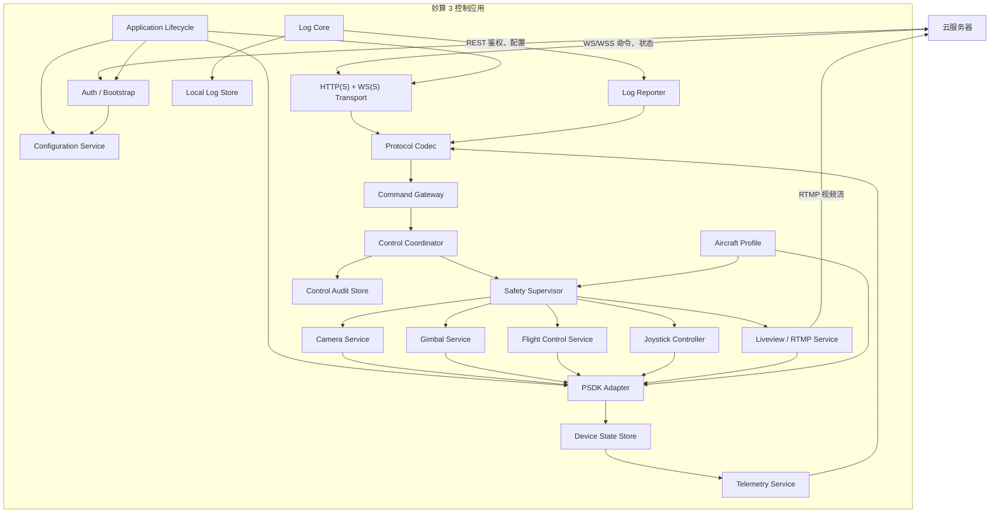
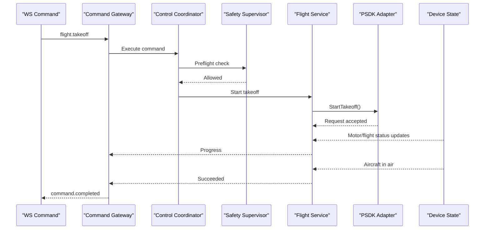

# 妙算 3 PSDK 云端控制应用架构设计

## 1. 项目定位

本项目定位为：

> 运行在妙算 3 上的云端飞行控制代理，负责统一鉴权、动态配置、WS/WSS 通信、设备状态上报，以及将云端业务指令转换为安全、有状态、有结果闭环的 PSDK 操作。

它不是简单的“WS → PSDK 函数转换器”，也不负责用户、订单、权限等云平台业务。

项目负责的是设备端业务：

- 管理应用和 PSDK 生命周期。
- 管理云端连接和会话。
- 管理 Cloud API/妙算控制模式。
- 执行飞行、云台、相机、直播等动作。
- 处理控制权、超时、失联和安全限制。
- 聚合、缓存和上报设备状态。
- 输出运行日志、审计日志和诊断信息。

当前首要支持 M4TD，未来通过机型适配层扩展其他机型。

---

## 2. 技术选型建议

### 2.1 主体语言

建议正式业务工程使用：

```text
C++17 业务代码
+
C 语言 PSDK API 适配层
```

原因：

- PSDK 对外是 C API，但业务包含大量状态机、线程、资源生命周期和异步回调。
- C++ 更适合表达服务、接口、资源所有权和模块依赖。
- 可以继续直接链接 `libpayloadsdk.a`。
- PSDK 回调仍使用 C 函数，通过静态桥接函数转给 C++ 对象。

需要约束：

- 不让异常穿越 PSDK C 回调边界。
- 使用明确的资源生命周期和线程退出流程。
- 避免在 PSDK 回调中执行阻塞操作。
- 所有第三方依赖支持 aarch64 静态构建。

如果必须使用纯 C，这套架构仍然成立，但状态机、队列和资源管理的实现成本会更高。

---

## 3. 总体架构



---

## 4. 分层设计

### 4.1 应用编排层

负责应用整体生命周期，不处理具体飞行业务。

主要模块：

```text
Application
LifecycleManager
ServiceRegistry
ShutdownCoordinator
HealthManager
```

职责：

- 按正确顺序初始化模块。
- 管理模块启动、停止和异常恢复。
- 管理应用状态。
- 捕获进程级异常和退出信号。
- 确保退出前停止摇杆、释放控制权、停止直播并落盘日志。

建议应用状态：

```text
BOOTING
LOCAL_CONFIG_READY
PSDK_INITIALIZING
PSDK_READY
AUTHENTICATING
WS_CONNECTING
ONLINE
DEGRADED
OFFLINE
STOPPING
FAILED
```

---

### 4.2 基础设施层

负责与操作系统和外部环境交互：

```text
platform/
├── filesystem
├── clock
├── task/thread
├── network
├── process
├── crypto
└── persistent_storage
```

该层不认识“起飞”“直播”等业务概念。

需要提供抽象接口：

```text
IClock
IFileSystem
ITaskExecutor
IHttpClient
IWebSocketClient
IPersistentStore
IProcessManager
```

这样测试时可以替换成模拟实现。

---

### 4.3 PSDK 适配层

这是业务层与 DJI PSDK 的唯一边界。

```text
psdk/
├── PsdkRuntime
├── AircraftInfoAdapter
├── FcSubscriptionAdapter
├── FlightControllerAdapter
├── GimbalAdapter
├── CameraAdapter
├── LiveviewAdapter
├── HmsAdapter
└── PsdkErrorMapper
```

职责：

- 调用 `DjiCore_Init()`、`DjiCore_ApplicationStart()`。
- 注册 PSDK 回调。
- 将 PSDK 类型转换为项目内部类型。
- 将 PSDK 错误码转换成统一错误模型。
- 隔离不同 SDK 版本的 API 差异。
- 不包含云协议解析和控制租约逻辑。

禁止其他业务模块直接调用 `DjiFlightController_*` 等函数。

---

## 5. 核心业务模块

### 5.1 统一鉴权与引导模块

```text
bootstrap/
├── BootstrapClient
├── DeviceIdentityProvider
├── BootstrapResponseValidator
└── ConnectionTicketStore
```

启动流程：

1. 读取本地配置中的鉴权地址和设备 ID。
2. 调用 HTTP/HTTPS 鉴权接口。
3. 获取远程运行配置、WS/WSS 地址和一次性 ticket。
4. 校验配置版本、有效期和安全范围。
5. 原子保存最近一次有效配置。
6. 通知 WS 模块建立连接。

本地配置只保留：

- 鉴权地址。
- 设备 ID。
- 设备凭据。
- CA/开发环境证书。
- 设备硬安全限制。
- 最低可运行默认配置。

连接引导约束：

- 鉴权服务可以返回与自身不同主机或 IP 的 WS/WSS 地址，以支持开发环境、区域调度和故障切换。
- 返回内容至少包括 `ws_url`、`connection_ticket`、`ticket_expires_at`、服务端时间、协议版本和配置版本。
- ticket 应短时有效、一次性使用，并绑定设备 ID、目标 WS 服务和本次鉴权请求；WS 断开后不得重复使用旧 ticket。
- WS 建立后，服务端返回 `session_ready`，包含 `session_id`、当前期望控制模式、控制世代 `generation` 和服务端时间；在此之前只允许会话类消息。
- 测试环境允许 HTTP/WS，但仅用于可信局域网或隔离测试网络；正式环境使用 HTTPS/WSS 并严格校验证书。
- 鉴权不可用时不得复用已过期 ticket。可以缓存最近一次有效运行配置，但重新建立 WS 前仍需重新鉴权。

---

### 5.2 配置管理模块

```text
config/
├── ConfigService
├── LocalConfigLoader
├── RemoteConfigLoader
├── ConfigValidator
├── ConfigSnapshot
└── ConfigPersistence
```

配置分为三类：

| 配置类型 | 来源 | 示例 |
|---|---|---|
| 设备硬配置 | DPK/本地 | PSDK 身份、CA、绝对速度上限 |
| 远程运行配置 | 首次鉴权接口 | WS 地址、遥测频率、功能开关 |
| 飞行会话配置 | 每次飞行前 | 失联动作、租约、速度和高度限制 |

优先级：

```text
设备硬安全上限
        ∩
远程运行限制
        ∩
本次飞行限制
        =
实际生效限制
```

配置更新要求：

- 带 `schema_version` 和 `config_version`。
- 先完整校验，再原子切换。
- 保留上一份有效配置。
- 更新失败不能影响当前运行配置。
- 远程配置只能收紧安全限制，不能突破设备硬上限。

业务模块读取不可变的 `ConfigSnapshot`，不直接读写配置文件。

---

### 5.3 WS/WSS 通信模块

```text
transport/
├── IWebSocketClient
├── WebSocketClient
├── ConnectionManager
├── ReconnectPolicy
├── HeartbeatManager
├── OutboundQueue
└── ConnectionState
```

职责：

- 建立和维护 WS/WSS。
- ticket 鉴权。
- 心跳和超时检测。
- 指数退避重连。
- 控制发送队列。
- 上报连接状态。
- 重连后执行会话同步。

该模块只负责可靠传输，不解释飞行命令。

正式环境：

```text
HTTPS + WSS
```

测试环境：

```text
HTTP + WS
```

生产构建应禁止动态关闭 TLS 校验。

传输选型结论：第一版采用 **REST 鉴权引导 + WS/WSS 业务通道**。

| 方案 | 优点 | 代价 | 本项目结论 |
|---|---|---|---|
| WS/WSS | 全双工、迁移现有原型成本低、开发调试方便 | ACK、TTL、幂等和会话恢复需自行定义 | 第一版采用 |
| MQTT 5 | 原生 QoS、会话过期、消息过期和遗嘱，适合大规模设备 | 需要 Broker、Topic、ACL 和积压策略 | 暂不实现，保留 transport adapter 扩展能力 |
| gRPC 双向流 | 强类型、代码生成、流式接口清晰 | HTTP/2、protobuf 和 aarch64 静态依赖更复杂 | 当前不采用 |

为避免未来被 WS 锁定，`transport` 对上层只暴露发送消息、接收消息和连接状态等接口；业务消息 envelope、控制状态机和错误模型不得直接依赖 WebSocket API。重连后必须执行 `session_sync`，不能把 TCP/WS 连接本身当作业务状态真相。

---

### 5.4 协议模块

```text
protocol/
├── MessageEnvelope
├── MessageCodec
├── MessageValidator
├── ProtocolVersionManager
├── CommandResultCodec
└── ErrorCodeMapper
```

统一消息结构：

```json
{
  "protocol_version": "1.0",
  "type": "flight.takeoff",
  "message_id": "msg-001",
  "correlation_id": "req-001",
  "session_id": "session-001",
  "device_id": "manifold-001",
  "timestamp": 1784540000000,
  "payload": {}
}
```

控制指令额外包含：

```json
{
  "generation": 12,
  "lease_id": "lease-001",
  "seq": 1024,
  "ttl_ms": 1000
}
```

协议层负责：

- JSON 解析。
- Schema 校验。
- 版本兼容。
- 字段完整性。
- 消息大小限制。
- `seq`、TTL、重复消息的基础判断。

协议层不调用 PSDK。

---

### 5.5 Command Gateway

```text
command/
├── CommandGateway
├── CommandRegistry
├── CommandContext
├── CommandDeduplicator
└── CommandResultPublisher
```

负责把协议消息路由到具体业务服务：

```text
flight.takeoff       → FlightControlService
flight.land          → FlightControlService
flight.go_home       → FlightControlService
flight.joystick      → JoystickController
gimbal.rotate        → GimbalService
camera.zoom          → CameraService
live.start           → LiveService
live.stop            → LiveService
```

Command Gateway 只允许调用业务接口，不直接调用 PSDK Adapter。

---

### 5.6 控制协调器

```text
control/
├── ControlCoordinator
├── ControlModeStateMachine
├── ControlLeaseManager
├── FlightSessionManager
├── CommandArbiter
└── AuthorityMonitor
```

这是所有飞行控制命令的统一入口。

负责：

- `CLOUD_API` 与 `MANIFOLD_PSDK` 模式切换。
- desired mode 和 actual mode 管理。
- generation 和 lease。
- PSDK 控制权获取、释放和丢失处理。
- 指令互斥。
- 飞行会话生命周期。
- 防止摇杆、FlyTo、返航等冲突执行。

状态建议：

```text
CLOUD_API
SWITCHING_TO_PSDK
PSDK_READY
PSDK_CONTROL
SWITCHING_TO_CLOUD_API
FAILSAFE
AUTHORITY_LOST
```

控制模式分为两类状态：

- `desired_control_mode`：云端期望使用 `CLOUD_API` 或 `MANIFOLD_PSDK`。
- `actual_control_mode`：妙算根据 PSDK 控制权回调确认的实际状态。

切换到妙算控制：

1. 云端停止新的 Cloud API 飞行指令，并确认不存在活动 DRC 或飞行任务。
2. 云端发送 `control_mode_prepare`，携带目标模式、`generation`、`lease_id` 和租约过期时间。
3. 妙算检查飞行器、定位、电量、HMS、应用状态和飞行会话配置。
4. 妙算调用 PSDK 获取控制权，并等待控制权事件确认。
5. 妙算返回 `control_mode_ready`，携带实际控制权状态。
6. 云端发送 `control_mode_commit` 后，妙算才进入 `PSDK_CONTROL`。

切换回 Cloud API：

1. 妙算停止接收新的飞行和摇杆命令。
2. 停止本地摇杆循环，输出安全值，并按当前状态刹停或取消动作。
3. 释放 PSDK 控制权并等待事件确认。
4. 上报 `control_mode_released`。
5. 云端确认释放后，才允许 Cloud API 控制命令进入执行层。

强制规则：

- 所有飞行命令携带 `generation + lease_id + seq + issued_at + ttl_ms`。
- 旧 generation、过期租约、重复或倒序 seq 一律拒绝。
- PSDK 控制权被遥控器、机场或其他模块夺走时，立即停止输出并上报 `AUTHORITY_LOST`。
- 不允许应用自动反复抢夺控制权；恢复控制必须由云端发起新的切换世代。

---

### 5.7 Safety Supervisor

```text
safety/
├── SafetySupervisor
├── PreflightChecker
├── CommandLimitPolicy
├── LinkLossMonitor
├── FailsafeExecutor
└── SafetyState
```

所有控制命令必须先通过该模块。

检查项：

- 当前控制模式。
- PSDK 实际控制权。
- 控制租约。
- 指令 TTL 和序号。
- 飞行器状态。
- GPS/定位质量。
- 电量。
- HMS。
- 返航点和返航高度。
- 速度、高度和 Yaw 限制。
- 当前是否存在冲突任务。

失联处理：

```text
摇杆指令过期
→ 停止使用旧值
→ 输出安全值或刹停

WS 持续失联
→ 执行本次 flight_session 指定动作
→ HOVER / GO_HOME / LAND
```

Safety Supervisor 拥有否决权，任何功能模块不能绕过它调用飞控。

每次飞行前，云端通过 `flight_session_open` 下发并由妙算确认：

- `flight_session_id`
- `control_lease_id`
- `command_stale_timeout_ms`
- `link_loss_timeout_ms`
- `link_loss_action`: `HOVER | GO_HOME | LAND`
- 本次允许的速度、高度、Yaw 速率和地理边界
- 返航高度及必要的返航前置条件
- `policy_version`

设备端规则：

- 未收到并确认有效失联策略时，不进入妙算飞行控制模式。
- 服务端下发的限制必须落在设备固化安全上限内，服务端只能收紧限制。
- `command_stale_timeout_ms` 用于判断摇杆目标过期；过期后立即停止沿用旧值。
- `link_loss_timeout_ms` 用于判断整条云连接失联，并执行本次飞行指定动作。
- 飞行中修改策略必须提升 `policy_version` 并等待设备 ACK，不能静默覆盖。
- 网络恢复后不得恢复旧摇杆或旧动作，必须重新建立飞行会话和控制租约。
- 具体超时值通过模拟弱网和真机测试确定，再固化为服务端允许范围和设备硬上限。

---

## 6. 具体功能模块

### 6.1 设备数据订阅与上报

```text
telemetry/
├── SubscriptionManager
├── DeviceStateStore
├── TelemetryAggregator
├── TelemetryScheduler
├── TelemetryPublisher
└── EventPublisher
```

处理流程：

```text
PSDK 回调
→ SubscriptionManager
→ 更新 DeviceStateStore
→ TelemetryAggregator 生成快照
→ TelemetryScheduler 按频率上报
```

PSDK 回调中只进行：

- 数据复制。
- 时间戳记录。
- 投递内部队列。

禁止在 PSDK 回调中：

- 直接发送 WS。
- 写大文件。
- 等待锁。
- 执行复杂 JSON 序列化。

上报分级：

| 类型 | 建议方式 |
|---|---|
| 位置、速度、姿态 | 5～20 Hz |
| 飞行模式、电量、GPS | 1 Hz 或变化上报 |
| HMS、控制权变化 | 事件上报 |
| 应用健康、CPU、存储 | 低频上报 |
| 摇杆和失联状态 | 变化上报 |

---

### 6.2 飞行控制模块

```text
flight/
├── FlightControlService
├── TakeoffAction
├── LandingAction
├── GoHomeAction
├── FlyToAction
├── BrakeAction
└── FlightActionStateMachine
```

每个动作具有统一生命周期：

```text
CREATED
PRECHECKING
ACCEPTED
EXECUTING
SUCCEEDED
FAILED
CANCELLED
TIMEOUT
AUTHORITY_LOST
```

例如起飞：



---

### 6.3 远程摇杆模块

```text
joystick/
├── JoystickController
├── JoystickSetpointBuffer
├── JoystickLoop
├── JoystickLimiter
└── JoystickWatchdog
```

云端消息不直接触发一次 PSDK 调用。

```text
WS 10～30 Hz 更新目标值
        ↓
JoystickSetpointBuffer
        ↓
本地 JoystickLoop 50～100 Hz
        ↓
PSDK ExecuteJoystickAction
```

该模块使用专用线程，并保证：

- 最新值覆盖旧值。
- seq 必须递增。
- 指令过期后不再使用。
- 控制权丢失立即停止输出。
- WS 断开触发 Safety Supervisor。
- 重连后不恢复旧 setpoint。

---

### 6.4 云台模块

```text
gimbal/
├── GimbalService
├── GimbalCommandValidator
└── GimbalStateTracker
```

提供稳定业务接口：

```text
rotate
reset
set_mode
stop
get_state
```

机型对应的挂载位置、角度范围和支持模式由 `AircraftProfile` 提供。

---

### 6.5 相机模块

```text
camera/
├── CameraService
├── CameraCapability
├── CameraStateTracker
└── CameraCommandValidator
```

预留能力：

- 拍照。
- 开始/停止录像。
- 变焦。
- 对焦。
- 镜头切换。
- 相机状态上报。

首版只开放 M4TD 已确认并完成真机验证的能力。

---

### 6.6 Liveview 与 RTMP 模块

```text
live/
├── LiveService
├── LiveviewReceiver
├── H264StreamHandler
├── IRtmpPublisher
├── FfmpegRtmpPublisher
└── LiveStateMachine
```

状态：

```text
STOPPED
STARTING
STREAMING
RECONNECTING
STOPPING
FAILED
```

处理流程：

```text
live.start
→ 校验 RTMP 地址
→ 启动 RTMP Publisher
→ 启动 PSDK Liveview
→ H.264 回调写入 Publisher
→ 上报 STREAMING
```

要求：

- RTMP 地址必须经过白名单和格式校验。
- 不通过 shell 字符串拼接 URL。
- 视频不经过 WS。
- WS 只负责启停和状态上报。
- 支持断流、重连和关键帧请求。

---

## 7. 日志模块设计

日志模块应与其他业务模块物理区分，但通过统一接口供所有模块使用。

```text
logging/
├── ILogger
├── LogCore
├── AsyncLogQueue
├── ConsoleSink
├── FileSink
├── RemoteLogSink
├── LogRedactor
├── LogRotation
└── AuditLogger
```

### 7.1 依赖规则

```text
业务模块 → ILogger 接口
LogCore → 本地日志文件
LogReporter → 上报接口
```

禁止：

```text
业务模块 → 直接写文件
业务模块 → 直接通过 WS 上报日志
LogCore → 依赖 WS ConnectionManager
```

否则会形成循环依赖：

```text
WS 出错
→ 写日志
→ 日志尝试使用 WS 上报
→ 再次触发 WS 错误
```

### 7.2 日志类型

| 类型 | 用途 |
|---|---|
| Runtime Log | 普通运行和调试 |
| Error Log | 模块异常和错误码 |
| Audit Log | 控制权、飞行命令、失联动作 |
| Diagnostic Event | CPU、内存、网络、线程健康 |
| Flight Event | 起飞、降落、返航等关键事件 |

审计日志应独立保存：

```text
谁发起
何时发起
控制租约
原始命令摘要
设备状态
执行结果
控制权变化
失联保护动作
```

### 7.3 性能要求

- 日志写入必须异步。
- 控制线程只向有界队列写入。
- 队列满时丢弃低级别日志，不能阻塞飞控。
- ERROR、AUDIT 等关键日志单独保留。
- 日志上报失败不影响飞行控制。
- 对 token、ticket、私钥和 RTMP stream key 脱敏。

---

## 8. 内部事件与状态管理

建议建立有限、强类型的内部事件机制：

```text
events/
├── ConnectionEvent
├── AuthorityEvent
├── FlightStateEvent
├── HmsEvent
├── ConfigChangedEvent
└── LiveStateEvent
```

不要使用一个无类型的全局 JSON EventBus。

关键状态需要明确唯一拥有者：

| 状态 | 唯一拥有模块 |
|---|---|
| WS 连接状态 | ConnectionManager |
| 当前控制模式 | ControlCoordinator |
| PSDK 控制权 | AuthorityMonitor |
| 当前飞行会话 | FlightSessionManager |
| 最新设备数据 | DeviceStateStore |
| 当前摇杆目标 | JoystickSetpointBuffer |
| 当前直播状态 | LiveService |
| 当前有效配置 | ConfigService |

其他模块只能读取快照或订阅事件，不能直接修改。

---

## 9. 线程模型

建议至少划分：

| 线程/执行器 | 职责 |
|---|---|
| Main | 生命周期和进程信号 |
| Network Event Loop | HTTP、WS 收发 |
| Command Executor | 离散业务命令 |
| Telemetry Worker | 状态聚合和序列化 |
| Joystick Loop | 本地定频摇杆输出 |
| Live Stream Worker | H.264/RTMP 数据处理 |
| Log Writer | 本地日志落盘 |
| Log Reporter | 远程日志上报 |

约束：

- 飞行控制命令串行执行。
- 相机和云台可以使用独立执行队列。
- Joystick 使用专用循环，不能与普通命令共用线程。
- 网络线程不调用耗时 PSDK 操作。
- PSDK 回调不执行网络和文件 I/O。
- 日志线程永远不能阻塞控制线程。

---

## 10. 多机型适配

```text
aircraft/
├── IAircraftProfile
├── AircraftProfileRegistry
├── AircraftDetector
└── profiles/
    └── m4td/
        ├── M4tdProfile
        ├── M4tdCapabilities
        └── M4tdLimits
```

`AircraftProfile` 提供：

- 支持的功能。
- PSDK Topic。
- 相机源。
- 云台挂载位置。
- 速度和高度范围。
- 控制模式差异。
- 已验证固件范围。
- 特殊前置检查。

业务代码禁止：

```text
if aircraft == M4TD
else if aircraft == M4T
```

新增机型时应增加 Profile/Adapter，而不是修改所有业务模块。

未知机型只能：

- 启动应用。
- 完成鉴权。
- 上报机型和诊断。
- 拒绝飞行控制。

---

## 11. 推荐项目目录

```text
applications/manifold_cloud_agent/
├── CMakeLists.txt
├── README.md
│
├── include/
│   └── manifold_agent/
│
├── src/
│   ├── app/
│   ├── bootstrap/
│   ├── config/
│   ├── transport/
│   ├── protocol/
│   ├── command/
│   ├── control/
│   ├── safety/
│   ├── telemetry/
│   ├── logging/
│   ├── events/
│   ├── aircraft/
│   ├── psdk/
│   ├── flight/
│   ├── joystick/
│   ├── camera/
│   ├── gimbal/
│   ├── live/
│   ├── persistence/
│   └── platform/manifold3/
│
├── config/
│   ├── config.schema.json
│   ├── default.json
│   └── development.json
│
├── packaging/
│   ├── app.json
│   ├── assets/
│   └── certs/
│
├── tests/
│   ├── unit/
│   ├── protocol/
│   ├── integration/
│   ├── simulator/
│   └── hil/
│
└── third_party/
    └── LICENSES/
```

---

## 12. 启动顺序

```text
1. 初始化最小控制台日志
2. 读取本地配置
3. 初始化文件、时钟、任务等平台能力
4. 初始化正式日志系统
5. 初始化 PSDK Runtime
6. 读取飞机型号和固件
7. 加载 M4TD AircraftProfile
8. 初始化 FC/HMS/控制权数据订阅
9. 调用 REST 鉴权接口
10. 校验并应用远程配置
11. 建立 WS/WSS
12. 完成 session_ready/session_sync
13. 启动遥测和日志上报
14. 允许非飞行命令
15. 完成控制模式切换和 flight_session 后允许飞控命令
```

如果鉴权或 WS 失败：

- 应用保持运行。
- PSDK 状态订阅继续工作。
- 日志保存在本地。
- 禁止云端飞行控制。
- 按重连策略继续尝试。
- 不因为云端断开而反复初始化 PSDK。

---

## 13. 停止顺序

```text
1. 停止接收新命令
2. 停止 Joystick 输出
3. 根据当前状态执行必要刹停
4. 释放 PSDK 控制权
5. 停止 Liveview/RTMP
6. 停止遥测和日志上报
7. 关闭 WS
8. 停止数据订阅
9. DeInit PSDK 模块
10. 刷新关键日志并退出
```

---

## 14. 构建与 DPK

正式工程应拥有独立构建目标：

```text
manifold_cloud_agent
```

打包要求：

- 链接 aarch64 PSDK 静态库。
- 第三方依赖静态链接或随 DPK 打包。
- 使用自己的 `packaging/app.json`。
- `userconfig` 只包含必要配置、证书和资源。
- 不打包整个官方 `samples` 目录。
- 不把设备长期凭据提交到 Git。
- 校验代码版本和 `app.json.firmware_version` 一致。
- 测试配置允许 HTTP/WS。
- 正式配置强制 HTTPS/WSS。
- `user_app_id`、代码固件版本和 `app.json.firmware_version` 在构建阶段自动校验一致性。
- DPK 只包含业务二进制、必要配置、证书、RTMP 后端和第三方许可证清单。
- 不依赖 root 在线安装第三方库；依赖应以静态库、源码或已审计的静态工具随包交付。
- 配置采用只读默认配置、设备持久配置、鉴权服务动态配置三层结构，长期密钥不得进入仓库。

构建产物：

```text
build/bin/manifold_cloud_agent
build/dpk/ManifoldCloudAgent_vXX.XX.XX.XX.dpk
```

---

## 15. 实施路线

### 15.1 第一阶段：正式工程和基础闭环

项目起步阶段先完成“空业务骨架”，不立即实现真实飞控：

1. 正式工程目录和独立 CMake target。
2. 应用生命周期和模块注册。
3. 独立日志系统。
4. 本地配置读取和校验。
5. REST 鉴权与远程配置。
6. WS/WS 会话、心跳和重连。
7. PSDK 初始化和 M4TD 识别。
8. FC 数据订阅、状态存储和遥测上报。
9. Command Gateway 和模拟命令执行。
10. DPK 构建、安装、启动和停止。

第一阶段完成时应形成：

```text
配置读取
→ PSDK 初始化
→ M4TD 识别
→ REST 鉴权
→ WS 建连
→ 遥测上报
→ 模拟命令
→ 统一日志
→ DPK 发布
```

在这个骨架稳定后，再按顺序加入：

```text
控制模式与租约
→ 云台/相机
→ 指令飞行
→ 远程摇杆
→ 失联保护
→ RTMP 直播
```

这样可以确保每个具体功能模块都建立在统一的配置、通信、状态、日志和安全基础设施之上。

### 15.2 后续阶段

#### 阶段 0：协议与安全契约冻结

- 定义 REST 鉴权请求/响应、WS/WSS envelope、错误码和协议版本策略。
- 定义控制模式状态机、租约、generation 和每次飞行失联策略。
- 定义 M4TD 第一版能力矩阵。
- 产出云端与设备端共享的 JSON Schema 和协议测试向量。

完成标准：非法、过期、重放消息以及模式切换、控制权丢失和失联动作都有唯一且可测试的行为。

#### 阶段 2：正式 WS/WSS 通信

- 完成动态 WS 地址、一次性 ticket、心跳、自动重连和 `session_sync`。
- 实现 ACK、TTL、幂等缓存和协议版本协商。
- 第一轮只开放遥测和诊断，不开放真实飞控。

#### 阶段 3：控制仲裁与设备属性

- 实现 desired/actual 控制模式、generation、lease 和 PSDK 控制权事件。
- 接入 FC、HMS、控制权、应用健康和安全状态上报。
- 所有飞控入口必须经过 Control Coordinator 和 Safety Supervisor。

#### 阶段 4：指令飞行

- 实现起飞、降落、返航、FlyTo、刹停和取消。
- 每项动作实现预检查、接受、执行、完成或失败闭环。
- 正式业务不得直接运行整段官方 flight sample。

#### 阶段 5：远程摇杆与失联保护

- 云端低频下发最新 setpoint，妙算本地定频调用 PSDK。
- 实现限幅、过期、倒序、租约、控制权和飞行状态校验。
- 实现每次飞行下发的 HOVER、GO_HOME、LAND 失联动作。

#### 阶段 6：RTMP 直播

- 将 Liveview 和 RTMP Publisher 接入正式服务。
- 完成 RTMP 地址校验、无 shell 启动、断流恢复和直播状态上报。

#### 阶段 7：真机验收和发布

- 地面验证控制权获取、释放和模式切换。
- 分级验证指令飞行、低速摇杆、WS 断链和控制权被抢夺。
- 验证 RTMP 长时间推流和弱网重连。
- 固化支持的 M4TD 固件范围、参数上限和失联时间范围。

---

## 16. 验收标准

- DPK 在干净的妙算 3 上安装、启动、停止和升级成功，不依赖 root 在线安装依赖。
- 测试环境能通过 HTTP 获取与鉴权服务不同的 WS 地址；正式环境能通过 HTTPS 获取 WSS 地址并严格校验证书。
- 过期 ticket、重复 ticket 和错误设备 ID 均被拒绝。
- 未知重大协议版本不能进入控制逻辑。
- 未完成 `control_mode_commit` 或没有实际 PSDK 控制权时，所有飞行命令被拒绝。
- 旧 generation、旧 lease、过期 TTL、重复或倒序 seq 被确定性拒绝。
- 每次飞行缺少有效失联策略时，无法进入妙算飞行控制模式。
- 模拟 WS/WSS 断开后，设备在配置阈值内执行该飞行指定的 HOVER、GO_HOME 或 LAND；恢复连接后不恢复旧控制。
- 遥控器或机场抢夺控制权后，妙算停止输出并上报 `AUTHORITY_LOST`。
- M4TD 完成地面控制权切换、单次起降、返航、FlyTo 和低速摇杆验证。
- RTMP 连续推流 30 分钟；断流后按策略恢复，且不存在将远端 URL 拼接进 shell 命令的路径。
- Git 和 DPK 中不存在明文长期设备令牌、云端密码或私钥日志输出。
- DPK 不打包整个 `samples` 目录。
- 未知机型只能连接和上报诊断，不能执行飞行控制。

---

## 17. 测试与验证计划

### 17.1 单元测试

- 控制模式状态机所有合法和非法转换。
- lease、generation、seq、TTL 和重放判断。
- 失联策略解析、版本更新和安全上下限。
- M4TD Profile 能力与参数范围。
- RTMP URL 校验和消息 JSON Schema。

### 17.2 集成测试

- 模拟 REST 鉴权服务与动态 WS/WSS 服务。
- 鉴权服务器与 WS/WSS 使用不同主机或 IP。
- WS/WSS 断开、超时、乱序、重复、服务端重启和设备重启。
- 云端 desired mode 与设备 actual mode 不一致时的对账。
- RTMP 服务拒绝、断流和恢复。

### 17.3 HIL/真机测试

1. 桨叶拆除或安全地面环境：PSDK 初始化、控制权获取释放、遥控器抢夺。
2. 室外低风险环境：起飞、悬停、降落、返航。
3. 低速低空环境：Joystick，并逐步注入延迟、抖动和丢包。
4. 飞行中断开 WS/WSS：分别验证 HOVER、GO_HOME、LAND。
5. Cloud API 与妙算双向切换，证明不存在重叠控制窗口。
6. RTMP 连续推流 30 分钟，并验证弱网和服务端重启恢复。

---

## 18. 风险与缓解

| 风险 | 缓解措施 |
|---|---|
| 云端通知模式与飞控实际控制权不一致 | desired/actual 双状态，以 PSDK 控制权回调为准 |
| 网络断开但 PSDK 仍保持飞控连接 | 妙算本地心跳、命令过期和失联动作 |
| 旧命令在重连后被执行 | generation、lease、seq、TTL、session sync |
| 测试环境配置进入正式版本 | 构建配置隔离，正式构建强制 HTTPS/WSS 和证书校验 |
| 正式应用继续依赖 sample 行为 | 独立工程、独立业务状态机和 PSDK Adapter |
| FFmpeg 依赖或命令注入 | 固定静态产物、无 shell 启动、受限 RTMP 地址 |
| 新机型差异散落在业务代码 | AircraftProfile/Adapter、能力矩阵和固件认证 |
| 第三方库导致 DPK 安装失败 | aarch64 静态依赖预检、最小包、干净设备安装测试 |

---

## 19. 本阶段不实施

- 5G 模组驱动、拨号、NetworkManager 配置和启动时序。
- Waypoint V3 航线下载、上传和任务执行。
- MQTT 或 gRPC transport 实现。
- M4TD 以外机型的正式飞行认证。
- Cloud API 服务端现有实现的详细设计；本计划只规定它需要参与控制模式编排和停止确认。

---

## 20. 参考资料

- WebSocket RFC 6455：https://www.rfc-editor.org/info/rfc6455/
- MQTT Version 5.0 OASIS：https://docs.oasis-open.org/mqtt/mqtt/v5.0/mqtt-v5.0.html
- gRPC Core Concepts：https://grpc.io/docs/what-is-grpc/core-concepts/
- PSDK 飞行控制权说明：`D:/workspace/A/Payload-SDK-Tutorial/docs/cn/50.function-overview/10.advanced-function/40.flight-control.md:456-474`
- 妙算 3 DPK 打包约束：`D:/workspace/A/Payload-SDK-Tutorial/docs/cn/40.manifold-quick-start/07.build-dpk.md:264-286`
